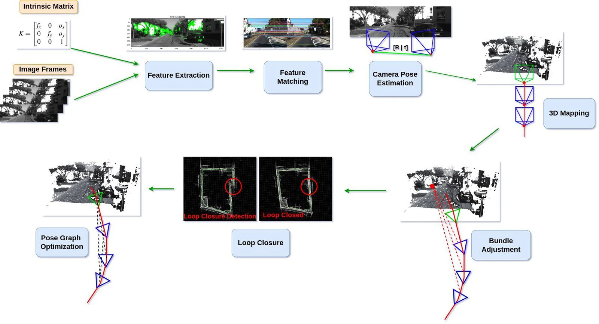

# 3D Gaussian Splatting 入门

有用资源指路：

👉原论文：[https://arxiv.org/pdf/2308.04079](https://arxiv.org/pdf/2308.04079)

👉论文仓库：[https://github.com/graphdeco-inria/gaussian-splatting](https://github.com/graphdeco-inria/gaussian-splatting)

👉OpenCV的讲解网站：[https://learnopencv.com/3d-gaussian-splatting](https://learnopencv.com/3d-gaussian-splatting)

本文主要基于上述资料完成，粗浅地介绍了3dgs的理论基础。

## Introduction

!!! question "3D reconstruction from multiple images"

    根据一组从不同角度和位置拍摄的二维照片构建一种三维表示。我们希望后续能够通过这个3d模型复现整个场景。

下面简单介绍一些常用的3d重建方法，虽然本文要介绍的3dgs解决问题的性能普遍更优，但它以这些技术为基础，相关性较强，所以有必要了解一下。

### Photogrammetry

这是最早用来解决这个问题的方法。

???+ note "基本原理"
    *"All these methods re-project and blend the input images into the novel view camera, and use the
    geometry to guide this re-projection."*

    

    - **Input：**[Intrinsic Matrix](https://blog.csdn.net/gwplovekimi/article/details/90172544 "清楚简明的介绍")（3×3的内参矩阵K）用来描述单个相机拍摄图片的过程，即现实世界的点如何投影到2D平面上（三维点坐标到二维点坐标的映射关系），Image Frames是一组从不同位置、角度拍摄采集的照片样本。  
    - **Feature Extraction：**系统在每张图片中找容易被重复识别的特征点（如边角处、边缘处、纹理较明显的位置等），即图中绿色点。(feature points)
    - **Feature Matching：**系统在不同图片的特征点之间寻找对应关系，也就是那些从不同视角都能看到的点，对应现实中同一个3D点。
    - **Camera Pose Estimation：**有了这两个方面的点的信息，我们就可以估计照下每张图片的相机之间的相对位置和朝向。我们用3×4的外参矩阵[R|t]表示相机的这两个信息（左边三列是旋转矩阵，右边一列是平移向量——这里采用了齐次坐标，这样坐标经过矩阵乘法后就自动把平移量加上了）。其中旋转矩阵R描述了相机的朝向，平移向量t描述了相机的平移，两者一起把世界坐标系中的3D点变换到相机坐标系，相机的朝向和位置构成相机的“位姿”(Pose)。

    &emsp;&ensp;   👉内参矩阵描述的是相机自身的成像方式，外参矩阵描述的是相机在世界坐标系中的信息。3D点先经过外参矩阵从世界坐标系变换到相机坐标系，而后经过内参矩阵投影到二维平面上。我们希望从这些2D点恢复原来的3D点。

    - **3D Mapping：**知道了多个相机的位置后，有了同一个点在多个角度的信息，我们就可以通过三角化(triangulation)计算/恢复空间中某个点的3D坐标，得到图中的点云。简单来说就是把不同位置得到的2D投影点反投影成一条3D射线，这些射线的相交处，就是我们要找的3D点。
    - **Bundle Adjustment：**这是优化步骤，它会同时优化相机矩阵和3D点的位置，目标是让3D点重新投影到2D后，尽可能接近原图中检测到的2D特征点。
    - **Loop Closure：**将相机围绕某个场景拍照，理论上相机轨迹应该闭合。然而，移动过程中，相机的位姿难免会存在误差（例如：相机不会完美按照预期轨迹和理想角度、有噪音干扰等），这些小误差逐步累积，可能导致系统误判起点和终点的距离，导致轨迹无法闭合。这个步骤通过特征匹配来识别高度相似的图像，找到分离的起终点，判断实际回环的位置。
    - **Pose Graph Optimization：**检测到回环后，系统会全局调整所有相机的位置和朝向，优化相机矩阵，使整体线路闭合。

**阶段**

- Structure from Motion (SfM)：估计相机位姿，恢复稀疏点云。
- Multi View Stereo (MVS)：在相机位姿的基础上估计像素深度，生成稠密点云。
- Dense reconstruction：进一步生成更完整的三维模型

👉上面那个流程图展示的是SFM的原理，后续还要经过MVS和Dense reconstruction来得到更完整的3D模型

**性能**

*"These methods produced excellent results in many cases, but typically cannot completely recover from unreconstructed regions, or from “over-reconstruction”,
when MVS generates inexistent geometry."*

### Neural Rendering and Radiance Fields（NeRF）

