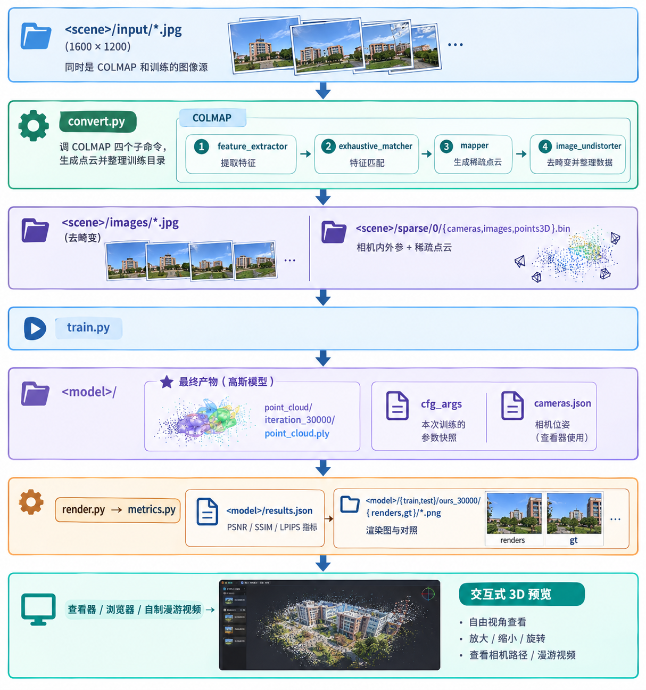

# 实践

>官方仓库：[https://github.com/graphdeco-inria/gaussian-splatting](https://github.com/graphdeco-inria/gaussian-splatting)
>OpenCV：[https://learnopencv.com/3d-gaussian-splatting/](https://learnopencv.com/3d-gaussian-splatting/) （内含复现教程）

---

## Training Pipeline

整个流程大致如下：

*
AI生成
*

具体的工具依赖、环境配置、代码和可调节参数，请参考官方仓库。

## 效果演示

!!! bug ""

    整体来看，我的模型的渲染效果不如原论文，原因主要在于我的拍摄设备和水平都比较差。如果能有一个好的相机，并能精心设计拍摄的角度、准备充足的照片，结果大概能好很多。

### 场景1：卡车玩具（官方仓库提供的一个数据集）

<table align="center" style="border: none;">
  <tr>
    <td align="center" style="border: none; padding: 0 5px;">
      
       
      
    </td>
    <td align="center" style="border: none; padding: 0 5px;">
      
       
      
    </td>
  </tr>
</table>

<table align="center" style="border: none;">
  <tr>
    <td align="center" style="border: none; padding: 0 5px;">
      
       
      
    </td>
    <td align="center" style="border: none; padding: 0 5px;">
      
       
      
    </td>
  </tr>
</table>

<table align="center" style="border: none;">
  <tr>
    <td align="center" style="border: none; padding: 0 5px;">
      
       
      原图
    </td>
    <td align="center" style="border: none; padding: 0 5px;">
      
       
      3dgs渲染
    </td>
  </tr>
</table>

👉 模型在线预览链接：[https://superspl.at/scene/cf46b8da](https://superspl.at/scene/cf46b8da)

### 场景2：玩偶

用原图按拍摄顺序制作的漫游视频：

*
原场景
*

通过 SIBR 查看器查看模型渲染效果：

*
3D模型
*

👉 模型在线预览链接：[https://superspl.at/scene/379aa8bc](https://superspl.at/scene/379aa8bc)

### 场景3：竺可桢铜像

用原图按拍摄顺序制作的漫游视频：

*
原场景
*

通过 SIBR 查看器查看模型渲染效果：

*
3D模型
*

### 场景4：房间

用原图按拍摄顺序制作的漫游视频：

*
原场景
*

通过 SIBR 查看器查看模型渲染效果：

*
3D模型
*

