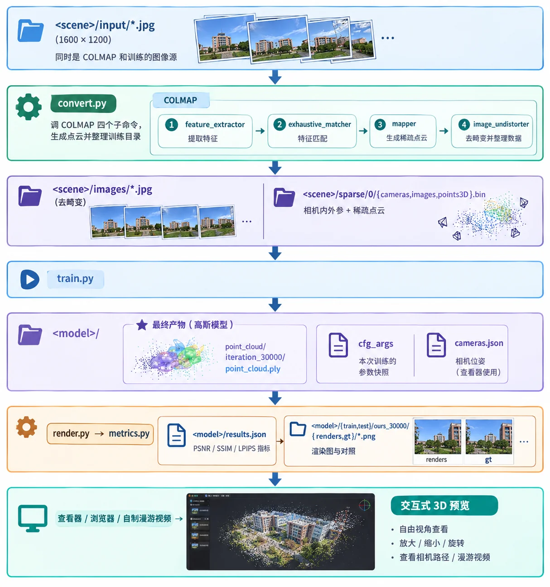
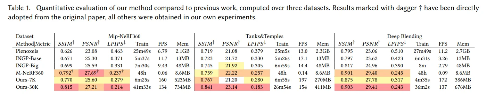
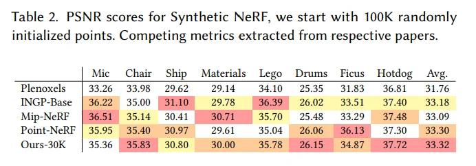

# 实践

>官方仓库：[https://github.com/graphdeco-inria/gaussian-splatting](https://github.com/graphdeco-inria/gaussian-splatting)
>OpenCV：[https://learnopencv.com/3d-gaussian-splatting/](https://learnopencv.com/3d-gaussian-splatting/) （内含复现教程）

---

## Training Pipeline

整个流程大致如下：

*
AI生成
*

更具体的工具依赖、环境配置、代码和可调节参数，请参考官方仓库。

## 经验杂谈

### 拍摄

**拍摄角度和姿势**

- 单个物体：拿相机围着物体走三圈，每走半步拍一张照片，分别获取在胸口/腰部平视、举到头顶俯视、放在大腿仰视这三个角度的图片，物体最好占图片的80%以上。
- 复杂场景：同样拿着相机沿场景边缘走三圈，同上。不同的是不要给场景中的单个物体拍特写，并且角落/转弯处/场景衔接处要多角度拍几张。
- 相机的旋转不要过多，必须要有平移。

>数量参考：一个西瓜大小的玩偶我拍了大概70多张照片，跨度十几米的房间我用了130多张照片。

**变焦**

相机拍摄过程中最好不要变焦，保持相同的焦距和分辨率、使用同一个设备。

>convert.py 硬编码了 --ImageReader.single_camera 1，假设所有照片共用一套内参，变焦后焦距会变。
>这时即便 SfM 靠场景匹配成功、高斯数量达标，重建也会失败。

可以在`convert.py`里做修改： `--ImageReader.single_camera 0`，但实测效果提升不大。

**采光**

拍物体要选有方向的光（早晚的侧光），尤其不要在阴天拍深色物体。

>深色物体在漫反射下没有明暗变化，模型无法识别出纹理的细节。

**多尺度混合**

如果同一场景中混合了近物和远景，两种尺度相互干扰，整体效果会很差。拍摄单物体时其在画面中的占比要足够大，给出足够的细节。

### 数据准备

**分辨率**

需要把原图压缩到合适的分辨率（如1600px）。

>COLMAP 能处理的像素尺度在 1 - 2 Mp。

>如果原图的尺寸和分辨率过大，图中的噪声、镜头的畸变也会被放大，COLMAP 的特征识别很容易出现问题，导致初始 SfM 点云有大量漂浮物(floater)/错位点。依赖初始点云的 3dgs 自然失败。

**图片格式**

苹果手机直接拍摄的 HEIC 照片格式无法被 COLMAP 读取，需要进行格式转换。

### 训练参数

**分辨率设置**

在训练中使用 `-r [参数]` 也可以对训练使用的原图分辨率（梯度下降时与渲染图对比）进行缩放，参数是压缩的比例。（如：`-r 1` 直接使用原图分辨率，`-r 2` 将原图分辨率除以 2）

>需要注意的是，如果使用较高的分辨率做训练，需要同时把高斯致密化的参数调高，否则没有足够多的高斯来拟合大量的像素。

- trade-off：rasterization 这步要训练的像素数会随分辨率提高而增长。如果机器的显存有限，高分辨率可能会挤占存储高斯要用的显存，导致分辨率提高后高斯数反而降低。

**学习率**

调节学习率的时候需要小心。如果调低尺度学习率 `--scaling_lr`，高斯的尺度变化会更平缓，虽然也许能够捕获更多细节，但是有很大的密度风险。如果高斯的尺度始终低于 split 的阈值，这会导致高斯异常稀疏。

此外，大场景还存在一个隐性致密化问题（split 阈值 = 本值 × 场景半径），如果场景尺度较大，大部分高斯可能永远不会分裂，density control 也就无效了。

### 问题诊断

**检测指标**

在训练中要判断是否出错，我们不能只看 loss 函数是否趋于 0，因为你不知道它是怎么达到 0 的，代码可能会为了降 loss 而强行调参。

我们主要从这两个指标进行分析：

- PSNR指标：来自 MSE ，反映像素的绝对差。

$$MSE = \frac{1}{mn} \sum_{i=0}^{m-1} \sum_{j=0}^{n-1} [I(i,j) - K(i,j)]^2$$

$$PSNR = 10 \cdot \log_{10}\left( \frac{\mathrm{MAX}_I^2}{MSE} \right)$$

- SSIM指标：反映更复杂的几何/光影（亮度、对比度、结构），“理论”中有。

通过比对**训练中**定期评估的指标值和训练结束后测试得到的指标值之间的差值，我们可以定位问题出现的位置。

**肉眼检测**

通过 SIBR 等查看器观看训练后的模型，考察场景具体哪里存在问题。如空中“飘絮”(floater，表明透明的高斯数量很多)；大场景里的物体乱成一团（大概率是尺度混合的问题）；走近能清晰观察到物体上的高斯球（拍摄细节不够或训练高斯密度不够，导致高斯球过大）······

## 效果演示

我一共训练了四个场景的模型，将每个场景效果最好的一轮模型展示在这里。

### 指标评测

|场景|PSNR|SSIM|
|:-:|:-:|:-:|
|lego|35.93|0.983|
|房间|21.70|0.842|
|玩偶|17.84|0.638|
|铜像|16.85|0.473|

**参照** （Ours- 30K 那一行）

*
图源：原论文table.1.&table.2.
*

!!! bug "评估"

    整体来看，除了 lego ，我的模型渲染效果都没有达到原论文的平均标准。原因主要在于我的拍摄设备和水平都比较差（除了 lego 的输入图片都是我自己拍的）。如果能有一个好的相机，并能精心设计拍摄的角度、准备充足的照片，结果大概能好很多。

    过程中我失败的经验教训也都写在前文了。

### 场景1：乐高玩具（官方仓库提供的一个数据集）

<table align="center" style="border: none;">
  <tr>
    <td align="center" style="border: none; padding: 0 5px;">
      
       
      
    </td>
    <td align="center" style="border: none; padding: 0 5px;">
      
       
      
    </td>
  </tr>
</table>

<table align="center" style="border: none;">
  <tr>
    <td align="center" style="border: none; padding: 0 5px;">
      
       
      
    </td>
    <td align="center" style="border: none; padding: 0 5px;">
      
       
      
    </td>
  </tr>
</table>

<table align="center" style="border: none;">
  <tr>
    <td align="center" style="border: none; padding: 0 5px;">
      
       
      原图
    </td>
    <td align="center" style="border: none; padding: 0 5px;">
      
       
      3dgs渲染
    </td>
  </tr>
</table>

👉 模型在线预览链接：[https://superspl.at/scene/cf46b8da](https://superspl.at/scene/cf46b8da)

### 场景2：玩偶

用原图按拍摄顺序制作的漫游视频：

*
原场景
*

通过 SIBR 查看器查看模型渲染效果：

*
3D模型
*

👉 模型在线预览链接：[https://superspl.at/scene/379aa8bc](https://superspl.at/scene/379aa8bc)

### 场景3：竺可桢铜像

用原图按拍摄顺序制作的漫游视频：

*
原场景
*

通过 SIBR 查看器查看模型渲染效果：

*
3D模型
*

### 场景4：房间

用原图按拍摄顺序制作的漫游视频：

*
原场景
*

通过 SIBR 查看器查看模型渲染效果：

*
3D模型
*

