# 3D Gaussian Splatting 入门

>有用资源指路：

>👉原论文电子版：[https://arxiv.org/pdf/2308.04079](https://arxiv.org/pdf/2308.04079)

>👉论文仓库：[https://github.com/graphdeco-inria/gaussian-splatting](https://github.com/graphdeco-inria/gaussian-splatting)

>👉OpenCV的讲解网站：[https://learnopencv.com/3d-gaussian-splatting](https://learnopencv.com/3d-gaussian-splatting)

>👉知乎文章：[一文带你入门 3D Gaussian Splatting](https://zhuanlan.zhihu.com/p/680669616)

本文主要基于上述资料完成，整体按原论文的逻辑梳理，粗浅地介绍了3dgs的理论基础。

---

## Introduction

!!! question "3D reconstruction from multiple images"

    根据一组从不同角度和位置拍摄的二维照片构建一种三维表示。我们希望后续能够通过这个3d模型复现整个场景。

对于这个问题，我们要考虑主要有四点：

- 如何表示这个场景
- 如何根据已有的二维信息来建构这个表示模型
- 如何训练这个模型来让它尽可能准确
- 如何使用这个模型

## Related Work

下面简单介绍一些经典的3d重建方法，虽然本文要介绍的3dgs解决问题的性能普遍更优，但它以这些技术为基础，相关性较强，所以有必要了解一下。

### Photogrammetry

这是最早用来进行 3d 重建的一套流程，其中 SfM 被 3DGS 采用为前置步骤。

???+ note "SfM 基本原理"
    *"All these methods re-project and blend the input images into the novel view camera, and use the
    geometry to guide this re-projection."* —— Kerbl et al. 2023

    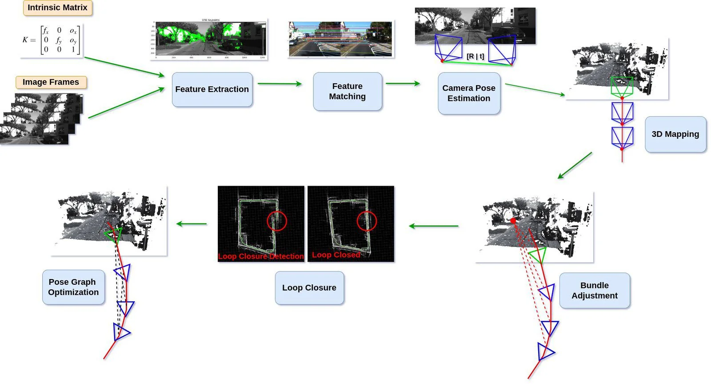

    *图源：OpenCV 3d-gaussian-splatting figure 2*

    - **Input：**[Intrinsic Matrix](https://blog.csdn.net/gwplovekimi/article/details/90172544 "清楚简明的介绍")（3×3的内参矩阵K）用来描述单个相机拍摄图片的过程，即现实世界的点如何投影到2D平面上（三维点坐标到二维点坐标的映射关系），Image Frames是一组从不同位置、角度拍摄采集的照片样本。  
    - **Feature Extraction：**系统在每张图片中找容易被重复识别的特征点（如边角处、边缘处、纹理较明显的位置等），即图中绿色点。(feature points)
    - **Feature Matching：**系统在不同图片的特征点之间寻找对应关系，也就是那些从不同视角都能看到的点，对应现实中同一个3D点。
    - **Camera Pose Estimation：**有了这两个方面的点的信息，我们就可以估计照下每张图片的相机之间的相对位置和朝向。我们用3×4的外参矩阵[R|t]表示相机的这两个信息（左边三列是旋转矩阵，右边一列是平移向量——这里采用了齐次坐标，这样坐标经过矩阵乘法后就自动把平移量加上了）。其中旋转矩阵R描述了相机的朝向，平移向量t描述了相机的平移，两者一起把世界坐标系中的3D点变换到相机坐标系，相机的朝向和位置构成相机的“位姿”(Pose)。

    &emsp;&ensp;   👉内参矩阵描述的是相机自身的成像方式，外参矩阵描述的是相机在世界坐标系中的信息。3D点先经过外参矩阵从世界坐标系变换到相机坐标系，而后经过内参矩阵投影到二维平面上。我们希望从这些2D点恢复原来的3D点。

    - **3D Mapping：**知道了多个相机的位置后，有了同一个点在多个角度的信息，我们就可以通过三角化(triangulation)计算/恢复空间中某个点的3D坐标，得到图中的点云。简单来说就是把不同位置得到的2D投影点反投影成一条3D射线，这些射线的相交处，就是我们要找的3D点。
    - **Bundle Adjustment：**这是优化步骤，它会同时优化相机矩阵和3D点的位置，目标是让3D点重新投影到2D后，尽可能接近原图中检测到的2D特征点。
    - **Loop Closure：**将相机围绕某个场景拍照，理论上相机轨迹应该闭合。然而，移动过程中，相机的位姿难免会存在误差（例如：相机不会完美按照预期轨迹和理想角度、有噪音干扰等），这些小误差逐步累积，可能导致系统误判起点和终点的距离，导致轨迹无法闭合。这个步骤通过特征匹配来识别高度相似的图像，找到分离的起终点，判断实际回环的位置。
    - **Pose Graph Optimization：**检测到回环后，系统会全局调整所有相机的位置和朝向，优化相机矩阵，使整体线路闭合。

**阶段**

- Structure from Motion (SfM)：估计相机位姿，恢复稀疏点云。
- Multi View Stereo (MVS)：在相机位姿的基础上估计像素深度，生成稠密点云。
- Dense reconstruction：进一步生成更完整的三维模型

**性能**

*"These methods produced excellent results in many cases, but typically cannot completely recover from unreconstructed regions, or from “over-reconstruction”,
when MVS generates inexistent geometry."* —— Kerbl et al. 2023

### Neural Rendering and Radiance Fields（NeRF）

NERF为3d重建引入了深度学习方法。

???+ note "NeRF步骤"

    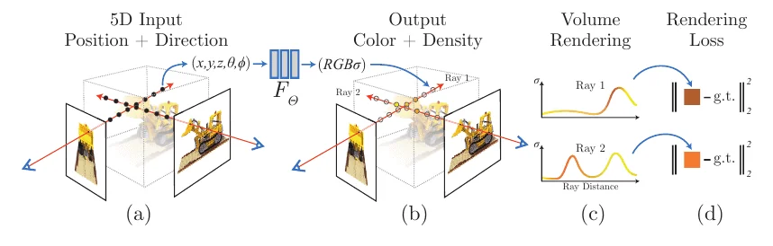

    *图源：Mildenhall et al., "NeRF: Representing Scenes as Neural Radiance Fields for View Synthesis", ECCV 2020, Fig. 2（[arXiv:2003.08934](https://arxiv.org/abs/2003.08934)）*
    
    - 建立辐射场函数 $F_\Theta(\mathbf{x}, \mathbf{d}) \rightarrow (\sigma, \mathbf{c})$

        输入： 
        
        1. 位置： $\mathbf{x}=(x,y,z)$
        2. 观察方向：$\mathbf{d}=(\theta,\phi)$

        输出： 体密度 $\mathbf{\sigma}$和RGB颜色 $\mathbf{c}$

        👉建模时假设物体各向同性，因此体密度仅由位置决定，与看的视角无关。颜色由位置、方向共同决定（镜面反射、材质折射率······）

    - 采样光线：对训练图上每个像素，从**相机中心**向其发一条射线，沿射线离散采样一组点作为样本。（巨量的样本！）
    - [位置编码](https://blog.csdn.net/leviopku/article/details/133317676)（positional encoding）：利用一组 $\sin/\cos$ 把坐标映射成一组正弦基 $\gamma(p) = \big(\sin(2^0\pi p), \cos(2^0\pi p),\ \sin(2^1\pi p), \cos(2^1\pi p),\ \dots,\ \sin(2^{L-1}\pi p), \cos(2^{L-1}\pi 
    p)\big)$

    &emsp; 把原先的输入提升成更高维的向量（维数$\times 2 L$倍）。
    
    &emsp; 🤔MLP（多层感知机）用梯度下降训练时，对输入的“分辨率”不够，难以识别微小的差异和变动。因此它天然倾向于学会较低频（在空间中变化慢）的函数，难以学会高频（在空间中变化快）的函数。

    ??? example "位置编码的例子"

        假设坐标归一化到 $[-1,1]$，考虑两个相邻点$x = 0.500$ 和 $x = 0.501$：

        - 直接输入网络：输入只差0.001，经过几层ReLU后，输出差异微乎其微。
        - 经过位置编码：令$L=10$，在$k=9$那一维是 $\sin(512\pi \Delta x)$，两个点的相位差被放大到 $512\pi \times 0.001 \approx 1.6$ 弧度，约为四分之一周期。

        位置编码使两点的差异沿不同频率被放大了 $2^k \pi$ 倍，让神经网络能够识别出微小变动。

        💡一个有趣的事实：为了避免周期性对样本的影响（两个坐标点映射到的高维向量完全一致），这种编码方式有两重防御机制。

        - sin/cos成对： $(\sin\theta, \cos\theta)$ 唯一确定一组极坐标，让函数在同周期内保持单射。
        - 要整体编码碰撞，必须在所有 $k=0,\dots,L-1$ 上同时对齐：

            令 $d=\Delta p$，则
            
            $$2^{k}\pi d \equiv 0 \pmod{2\pi} \iff 2^{k-1}d \in \mathbb{Z}, \quad \forall k$$

            考察k的不同取值：$k=0$ 给出 $d \in 2\mathbb{Z}$，$k=L-1$ 给出 $d \in 2^{2-L}\mathbb{Z}$，交集仍是 $d \in 2\mathbb{Z}$。

            因此，当且仅当d是偶数，编码才会在所有频率方向都无差异。而NeRF的坐标归一化到 $p \in [-1,1]$，宽度正好等于2，所以唯一会碰撞的只有 $\gamma(-1) = \gamma(1)$。这是边界，对域内的识别无影响。

    - 进入MLP：位置编码后的 $\mathbf{x}$ 先进网络 → 输出 $\sigma$ 和一个中间特征；中间特征再拼上编码后的 $\mathbf{d}$ → 最后输出颜色 $\mathbf{c}$。

    - [体渲染](https://blog.csdn.net/qq_42415112/article/details/134351239)（Volume Rendering）： 把这些离散点的颜色按不透明度从前往后加权累加，处理物体的遮挡与前后关系。

    $$\hat{C}(\mathbf{r}) = \sum_{i} T_i (1-e^{-\sigma_i\delta_i}) \mathbf{c}_i  \quad T_i = e^{-\sum_{j<i}\sigma_j\delta_j}$$

    - 损失 + 优化：把渲染出的像素颜色 $\hat{C}$ 和真实照片颜色对比，使用反向传播调参。

###  Point-Based Rendering and Radiance Fields

**点渲染（Point-Based Rendering）**

体渲染的离散形式，用点云来表示场景，把点投影到屏幕上来画图。点云通常来自Photogrammetry的 SfM 或 MVS 。

$\hat{C} = \sum_{i=1}^N T_i (1-e^{-\sigma_i\delta_i}) c_i, \qquad T_i = \prod_{j=1}^{i-1} e^{-\sigma_j \delta_j}$

*While true to the underlying data, point sample rendering suffers from holes, causes aliasing, and is strictly discontinuous.* —— Kerbl et al. 2023

🤔我们可以通过“ **Splatting** ”来解决这些问题——给每个点添加影响范围与权重，让它在屏幕上平滑地摊开。

👉3D高斯就是一种 Splatting 的方法。

**辐射场（Radiance Field）**

- 隐式辐射场：把5D坐标映射到密度&颜色，在NeRF中使用。它是续可微的，但是神经网络的开销很大。
- 显式辐射场：直接使用点云作为辐射场的骨架，每个点携带可学习的特征，在渲染时解码。它几何直观，训练快速，但只能 handle 简单的场景。

下面要谈的3DGS巧妙地把两种方向的优点缝合了起来。

*We first introduce 3D Gaussians as a flexible and expressive scene representation.
We start with the same input as previous NeRF-like methods, i.e.,
cameras calibrated with Structure-from-Motion (SfM) [Snavely et al.
2006] and initialize the set of 3D Gaussians with the sparse point
cloud produced for free as part of the SfM process.* —— Kerbl et al. 2023

## Overview

主要步骤如下：

- 3D Gaussians representation & projection
- Optimizing Gaussians to accurately capture the scene.
- Rendering 3D Gaussians onto a 2D image plane.
- Leveraging Spherical Harmonics to make 3DGS view-dependent.

##  Differentiable 3D Gaussian Splatting

我们拥有 SfM 得到的稀疏点云，现在，我们希望采用一种既高质量、可微又显式、快速的场景表达方法。研究者选择了3D gaussians。

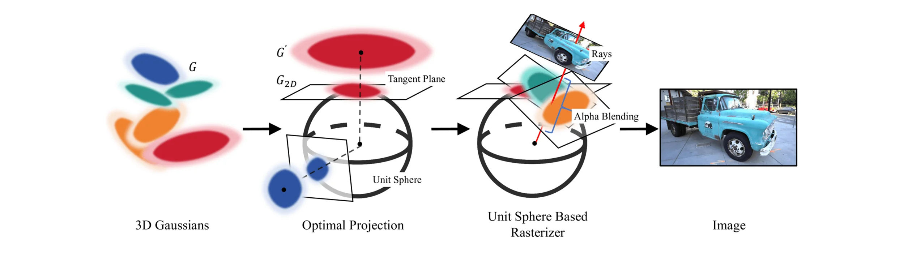

### Representation

**定义**

$$G(\mathbf{x}) = \exp\big(-\tfrac{1}{2}(\mathbf{x}- \boldsymbol{\mu})^{\top}\Sigma^{-1}(\mathbf{x}-\boldsymbol{\mu})\big)$$

- $\boldsymbol{\mu}\in\mathbb{R}^3$，表示均值，即高斯球的中心位置。
- $\Sigma\in\mathbb{R}^{3\times3}$，为协方差矩阵，决定高斯的形状和朝向（各向异性）。
- ${G(\mathbf{x}) : (\mathbf{x}-\boldsymbol{\mu})^{\top}\Sigma^{-1}(\mathbf{x}-\boldsymbol{\mu}) = 1}$ 是空间中以 $\boldsymbol{\mu}$ 为中心的一个椭球面。

👉公式详细的数学推导可见于[附录](https://st-anontokyo.github.io/notebook/cv/3dgs/math/)或参考[维基百科关于高斯分布的介绍](https://en.wikipedia.org/wiki/Multivariate_normal_distribution)。

🤔 形状和概率都是描述点的分布的函数，**高斯分布**和**三维高斯球**其实是同一个东西。

### Projection

有了这个 3D Gaussian 的模型，我们需要把它**投影**到二维（椭球 → 椭圆）才能够使用它，下面我们来介绍这种投影是如何一步步实现的。

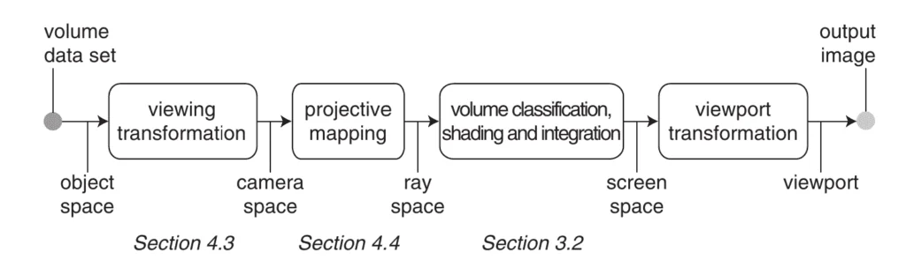

*
Forward Rendering Pipeline from Paper EWA Volume Splatting
*

#### Affine Transformation

!!! note "仿射变换"

    仿射变换是指在几何中，对一个向量空间进行一次线性变换并接上一个平移，变换为另一个向量空间。

    一般形式：

    $$\mathbf{y} = A \mathbf{x} + \mathbf{b}$$

对 $\mathbf{X}\sim\mathcal{N}(\boldsymbol{\mu},\Sigma)$，作仿射变换 $\mathbf{Y} = W\mathbf{X}+\mathbf{P}$

其中 $W$ 是旋转矩阵，$\mathbf{P}$ 是平移向量。

👉 这是为了把世界坐标翻译成相机坐标，是 3D → 3D 的映射。

于是有：

$$\mathbf{Y}\sim\mathcal{N}\big(W\boldsymbol{\mu}+\mathbf{P},\ W\Sigma W^{\top}\big)$$

其中：

- $\mathbf{Y} = [u_0,u_1,u_2]^{\top}$ 是相机坐标系中的一个 3D 点，$u_2$ 代表距离垂直于相机屏幕的“深度”。
- $\Sigma_{camera} = W \Sigma W^{\top}$ 是仿射变换之后的协方差矩阵。

??? tip "详细推导"

    $$\mathbb{E}[\mathbf{Y}] = W \mathbb{E}[\mathbf{X}]+\mathbf{P} = W\boldsymbol{\mu}+\mathbf{P}$$

    $$\mathrm{Cov}(\mathbf{Y}) = \mathbb{E}\big[(\mathbf{Y}-\mathbb{E}[\mathbf{Y}])(\mathbf{Y}-\mathbb{E}[\mathbf{Y}])^{\top}\big] = \mathbb{E}\big[W(\mathbf{X}-\boldsymbol{\mu})(\mathbf{X}-\boldsymbol{\mu})^{\top}W^{\top}\big] = W\mathbb{E}\big[(\mathbf{X}-\boldsymbol{\mu})(\mathbf{X}-\boldsymbol{\mu})^{\top}\big]W^{\top} = W\mathrm{Cov}(\mathbf{X})W^{\top} = W \Sigma W^{\top}$$

因此，只要投影是仿射的，协方差就依旧按 $A\Sigma A^{\top}$ 的形式传播，保持了高斯性。

#### Ray Space Transformation

!!! info "Ray Space"

    对相机空间中一个坐标 $u_2$ 的重参数化，把从相机内部中心点发出的视线转变成平行于距离轴的直线，我们就得到了射线空间。

    👉 直观理解：把射线绕着其与屏幕的交点掰成垂直于平面的直线。

对于空间中的射线$\mathbf{u}$，定义如下映射：

$$\boxed{\ m(\mathbf{u}) = \left(\frac{u_0}{u_2},\ \frac{u_1}{u_2},\ |\mathbf{u}|\right)\ }$$

其中：

- $\frac{u_0}{u_2},  \frac{u_1}{u_2}$ 是由[透视变换](https://www.cnblogs.com/jingrui/p/9874194.html)得到的。
- $|\mathbf{u}| = \sqrt{u_0^2+u_1^2+u_2^2}$ 是空间点到投影中心的距离，即那一部分**射线的长度**。
 
👉 保留长度值作为第三个坐标而不是直接将点投影到屏幕上，这样可以区分出不同点的深度。

???+ quote "演示：透视投影"

    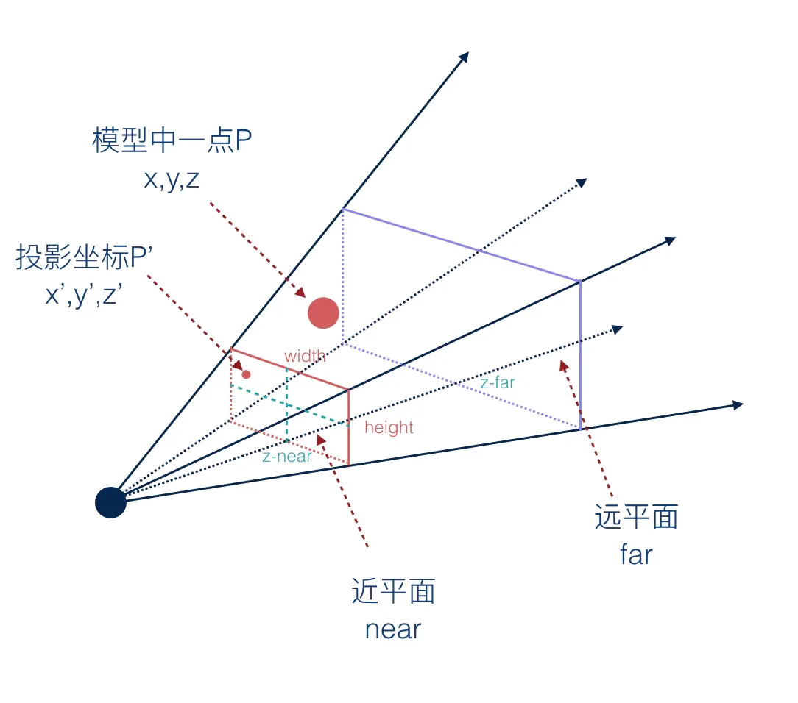

    想象把物体从近拿远，它的 $z$ ($u_2$) 坐标增大了，它在屏幕上的投影应该变小，投影坐标 $x'$ 和 $y'$ 都应该减小，上面映射公式的分母 $u_2$ 就起到这个效果。

    Ray Space Transformation 映射后的点，它的第一、二个坐标变为投影点的平面坐标，第三个坐标是原先的点到视线发出点的距离。

    💡原射线上的所有点，它们的前两个坐标都是相同的，只有深度不同。

然而，这种映射有一个问题——它是**非线性**的。

🥺 协方差传播公式 $\Sigma \to A\Sigma A^{\top}$ 的推导用到了 $\mathbb{E}[A\mathbf{X}] = A\mathbb{E}[\mathbf{X}]$，这要求 $A$ 是与 $\mathbf{X}$ 无关的常数矩阵。但透视矩阵中的 $1/u_2$ 随点变化，不满足这一点。

**局部仿射近似**

为了保持协方差的传播形式，我们使用一阶泰勒公式，将 $m(\mathbf{u})$ 在 $u_k$ 的邻域内线性化，使之在局部近似为一种仿射。

在核中心 $\mathbf{u}_k$ 处展开：

$$m(\mathbf{u}) \approx m(\mathbf{u}_k) + J_k(\mathbf{u}-\mathbf{u}_k)$$

其中 $J_k = \frac{\partial m}{\partial \mathbf{u}}(\mathbf{u_k})$ 是 $m$ 在 $\mathbf{u}_k$ 处的[雅可比矩阵](https://zh.wikipedia.org/wiki/%E9%9B%85%E5%8F%AF%E6%AF%94%E7%9F%A9%E9%98%B5)。整理成标准仿射形式：

$$m(\mathbf{u}) \approx \underbrace{J_k}_{A} \mathbf{u} + \underbrace{\big(m(\mathbf{u}_k) - J_k\mathbf{u}k\big)}_{\mathbf{b}}$$

😌 高斯的有效支撑集中在中心附近（$3\sigma$ 之外基本趋于 0），所以在这个小邻域里， $m$ 的一阶泰勒展开足够精确。

??? tip "雅可比矩阵的推导"

    对 $m(\mathbf{u}) = (\frac{u_0}{u_2},\ \frac{u_1}{u_2},\ |\mathbf{u}|)$ 求偏导：

    第一行：$\partial (u_0/u_2)$

    $$\frac{\partial}{\partial u_0}\frac{u_0}{u_2} = \frac{1}{u_2}, \qquad \frac{\partial}{\partial u_1}\frac{u_0}{u_2} = 0, \qquad
    \frac{\partial}{\partial u_2}\frac{u_0}{u_2} = -\frac{u_0}{u_2^{2}}$$

    第二行：$\partial (u_1/u_2)$

    $$\frac{\partial}{\partial u_0}\frac{u_1}{u_2} = 0, \qquad \frac{\partial}{\partial u_1}\frac{u_1}{u_2} = \frac{1}{u_2}, \qquad
    \frac{\partial}{\partial u_2}\frac{u_1}{u_2} = -\frac{u_1}{u_2^{2}}$$

    第三行：$\partial |\mathbf{u}|$

    $$\frac{\partial |\mathbf{u}|}{\partial \mathbf{u}} = \frac{\mathbf{u}}{|\mathbf{u}|} = \left(\frac{u_0}{|\mathbf{u}|},\
    \frac{u_1}{|\mathbf{u}|},\ \frac{u_2}{|\mathbf{u}|}\right)$$

    最终得到：

    $$J_k = \begin{bmatrix} \dfrac{1}{u_2} & 0 & -\dfrac{u_0}{u_2^{2}} \\ 0 & \dfrac{1}{u_2} & -\dfrac{u_1}{u_2^{2}} \\
    \dfrac{u_0}{|\mathbf{u}|} & \dfrac{u_1}{|\mathbf{u}|} & \dfrac{u_2}{|\mathbf{u}|} \end{bmatrix}_{\mathbf{u}=\mathbf{u}_k}$$

    **几何解释**

    - 前两行的对角项 $\frac{1}{u_2}$ ：横向放大率，描述透视的缩放。（离屏幕越远/$u_2$ 越大，投影越小）

    - 前两行的第三列 $-\frac{u_0}{u_2^2}, -\frac{u_1}{u_2^2}$：描述**深度**变化对横向位置的影响，是"透视感"的来源。为 0 则退化成正交投影。

    - 第三行 $\frac{\mathbf{u}}{|\mathbf{u}|}$ ：射线方向的单位向量。沿射线方向移动时距离变化最快，垂直方向最慢。

**射线空间中的协方差矩阵**

对于 $A = J_k$，直接套用仿射规则得到：

$$\boxed{\ \Sigma_{ray} = J_k\Sigma_{cam}J_k^{\top}\ }$$

又 $\Sigma_{cam} = W\Sigma W^{\top}$，有

$$\Sigma_{ray} = J_k\big(W\Sigma W^{\top}\big)J_k^{\top} = \underbrace{J_k W}_{A}\ \Sigma\ \underbrace{W^{\top}J_k^{\top}}_{A^{\top}}$$

可以看到最终的协方差矩阵仍然保持了经典的形式，投影点依然遵循高斯分布。

#### Screen Space Transformation

为了真正把 3D Gaussian 变为 2D Gaussian，我们需要丢掉一个维度，即原先向量坐标中表示距屏幕距离的第三个坐标。

我们把两段映射连起来看：

$$\text{相机空间} \xrightarrow{\ J_{3\times3}\ } \text{射线空间} \xrightarrow{\ P\ } \text{screen space}$$

其中 $P$ 是丢掉距离坐标的线性映射：

$$P = \begin{bmatrix} 1 & 0 & 0 \\ 0 & 1 & 0 \end{bmatrix} \qquad (x,\ y,\ d) \longmapsto (x,\ y)$$

按链式法则，相机 → 屏幕的雅可比矩阵 = 两步雅可比矩阵的乘积：

$$\boxed{\ J_{2\times3} = \underbrace{[I_2 \mid \mathbf{0}]}_{P}\cdot J_{3\times3}\ }$$

💡 也就是说，我们不再考虑原本的雅可比矩阵中描述空间中射线梯度的第三行。

所以最终的协方差矩阵可以写为

$$\Sigma'=J_{2\times3}W\Sigma W^{\top}J_{2\times3}^{\top}$$

注意到：

$$\Sigma_{\text{screen}} = P\Sigma_{ray}P^{\top} = \Sigma_{ray}\ \text{的左上} 2\times2\ \text{块}$$

因此最终得到的 $\Sigma'$矩阵是一个二维矩阵，我们实现了高斯分布的降维。

*Zwicker et al. [2001a] also show that if we skip the third row and column of Σ′, we obtain a 2×2 variance matrix with the same structure and properties as if we would start from planar points with normals, as in previous work [Kopanas et al. 2021].*

### 3D Gaussian to Ellipsoid

!!! warning

    本节存在大量细节的数学推导，在原论文和 OpenCV 中都没有详细说明，是我借助 AI 学习的。它们并不影响对主要思想的理解，可以斟酌阅读。

在训练 3D Gaussian 的时候，研究者需要对 $\Sigma$ 进行调参。

!!! question "协方差矩阵的合法性"

    当且仅当它是半正定时，协方差矩阵才有物理意义（方差 $\geq0$ ）。然而，研究者在优化 $\Sigma$ 时，采用了梯度下降法，这可能导致协方差矩阵变得不合法。那么，我们该如何表示 $\Sigma$ ，使之在训练过程中始终保持半正定呢？

在附录中，我们提到过 3D Gaussian 的公式实际上也描述了一个椭球，它们实际上是等价的。

- The eigenvalues of \Sigma determine the lengths of the ellipsoid’s principal axes.
- The eigenvectors of \Sigma determine the orientation of these axes in 3D space.

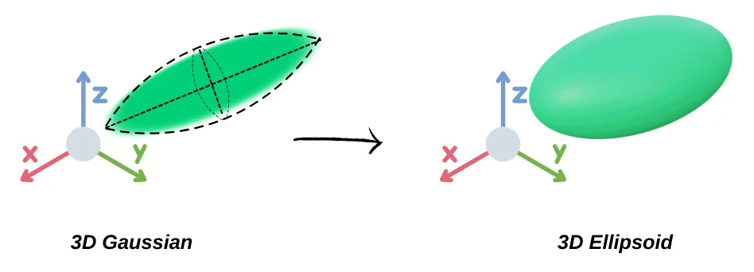

如果我们从椭球的几何性质出发，重新推导协方差矩阵 $\Sigma$ ，我们就始终能够得到半正定的协方差矩阵，这是由椭球性质决定的。

#### Decomposition of Covariance Matrix

??? tip "详细推导"

    **(1) 出发点：椭球是单位球的线性像**

    任何椭球由单位球仿射而来：

    $$\text{单位球 } {\mathbf{y}: |\mathbf{y}|=1} \quad\xrightarrow{\ \mathbf{x} = \boldsymbol{\mu} + A\mathbf{y}\ }\quad \text{一个椭球}$$

    反推椭球方程：由 $\mathbf{y} = A^{-1}(\mathbf{x}-\boldsymbol{\mu})$ 代入 $|\mathbf{y}|=1$：

    $$(\mathbf{x}-\boldsymbol{\mu})^{\top}(A^{-1})^{\top}A^{-1}(\mathbf{x}-\boldsymbol{\mu}) = 1 \quad\Longleftrightarrow\quad
    (\mathbf{x}-\boldsymbol{\mu})^{\top}(AA^{\top})^{-1}(\mathbf{x}-\boldsymbol{\mu}) = 1$$

    **(2) 对照高斯的水平集**

    高斯的单位等值面是：

    $$(\mathbf{x}-\boldsymbol{\mu})^{\top}\Sigma^{-1}(\mathbf{x}-\boldsymbol{\mu}) = 1$$

    两式相比：

    $$\boxed{\ \Sigma = AA^{\top}\ }$$

    用 $\Sigma$ 定义的高斯椭球和单位球经 $A$ 变换得到的椭球是同一个椭球，只要 $\Sigma = AA^{\top}$。

    (3) **规范形式（$A$ 不唯一）**

    🤔若 $A' = AQ$（$Q$ 正交），则：

    $$A'A'^{\top} = AQQ^{\top}A^{\top} = AA^{\top} = \Sigma$$

    因此，$\Sigma$ 唯一，但 $A$ 不唯一，造成了解的冗余。

    规范解的选择：考虑两个基本操作——拉伸和旋转 $A = RS$

    - $S = \mathrm{diag}(s_x,s_y,s_z)$：缩放（沿三个坐标轴进行拉伸）
    - $R$：旋转（正交，$R^{\top}R = I$，$\det R = 1$）

    $$\boxed{\ \Sigma = RSS^{\top}R^{\top} = R \mathrm{diag}(s_x^2,s_y^2,s_z^2)R^{\top}\ }$$

    👉 这种分解方式对后续优化是有利的，因为它把旋转和缩放拆成两组独立参数，可以让朝向和形状各自独立优化。

    几何变换过程：

    $$\underbrace{\text{单位球}}_{\mathbf{y}}\ \xrightarrow{\ \text{拉伸}S\ }\ \text{轴对齐椭球}\ \xrightarrow{\ \text{旋转}R\ }\
    \text{倾斜椭球}\ \xrightarrow{\ +\boldsymbol{\mu}\ }\ \text{平移到位}$$

我们得到协方差矩阵的分解形式：

$$\boxed{\ \Sigma = RSS^{\top}R^{\top}}$$

其中

$$S = \begin{bmatrix} s_x & 0 & 0 \\ 0 & s_y & 0 \\ 0 & 0 & s_z \end{bmatrix}
\qquad
S S^{\top} = \begin{bmatrix} s_x^2 & 0 & 0 \\ 0 & s_y^2 & 0 \\ 0 & 0 & s_z^2 \end{bmatrix} = \Lambda$$

为对角阵，其对角元的平方就是特征值，表示对球沿坐标轴进行缩放的倍数。

$R$ —— 正交矩阵，列是半轴方向

$$R = \begin{bmatrix} \vert & \vert & \vert \\ \mathbf{r}_1 & \mathbf{r}_2 & \mathbf{r}_3 \\ \vert & \vert & \vert \end{bmatrix}, \qquad \mathbf{r}_i \cdot \mathbf{r}_j = \delta_{ij}, \quad \det R = 1$$

其中 $\delta_{ij}$为[克罗内克函数](https://zh.wikipedia.org/zh-hans/%E5%85%8B%E7%BD%97%E5%86%85%E5%85%8B%CE%B4%E5%87%BD%E6%95%B0)，用于表示正交。

$R$ 的三个列向量构成标准正交基 —— 它们就是椭球三根半轴的方向向量，也是协方差矩阵的特征向量。

??? example "例子：二维椭圆 $\frac{x^2}{a^2} + \frac{y^2}{b^2} = 1$"

    $R = \begin{bmatrix}\cos\theta & -\sin\theta\\ \sin\theta & \cos\theta\end{bmatrix}$，$S = \mathrm{diag}(a,b)$，记 $c=\cos\theta,
    s=\sin\theta$：

    $$\Sigma = RSS^{\top}R^{\top} = \begin{bmatrix} a^2c^2 + b^2s^2 & (a^2-b^2)cs \\ (a^2-b^2)cs & a^2s^2 + b^2c^2 \end{bmatrix}$$

    验证两个不变量：

    $$\mathrm{tr}(\Sigma) = a^2+b^2 = \lambda_1+\lambda_2,\qquad \det(\Sigma) = a^2b^2 = \lambda_1\lambda_2 \quad\checkmark$$

#### Positive Semi-definite

对任意 $\mathbf{v}\in\mathbb{R}^3$：

$$\mathbf{v}^{\top}\Sigma\mathbf{v} = \mathbf{v}^{\top}RSS^{\top}R^{\top}\mathbf{v} =
(S^{\top}R^{\top}\mathbf{v})^{\top}(S^{\top}R^{\top}\mathbf{v}) = \big|S^{\top}R^{\top}\mathbf{v}\big|^{2} \ge 0$$

它是一个向量模的平方，所以恒非负。

???+ note "More on PSD （positive semi-definite）"

    **半正定性是由结构保证的，与参数的取值完全无关。**

    无论梯度下降把 $\mathbf{q}$ 和 $\mathbf{s}$ 推成什么值，$|S^{\top}R^{\top}\mathbf{v}|^2$ 永远不可能为负。

    **对比**：如果直接优化 $\Sigma$ 的 6 个元素

    $$\Sigma = \begin{bmatrix} a & b & c \\ b & d & e \\ c & e & f \end{bmatrix}\ \xrightarrow{\ \text{梯度步}\ \Sigma \leftarrow \Sigma -
    \eta\nabla\ }\ \Sigma \text{ 可能不再半正定}$$

    一旦某个特征值变负，$\Sigma^{-1}$ 存在但二次型没有下界 —— 等值面从椭球变成双曲面，高斯失去意义。

    **严格正定**

    上面的证明只给出半正定。要严格正定，需要 $S^{\top}R^{\top}\mathbf{v}\ne\mathbf{0}$ 对所有 $\mathbf{v}\ne\mathbf{0}$，即 $S$ 和 $R$
    都可逆，也就是 $s_i \ne 0$。

    在 3DGS 中，研究者使用自然常数激活来保持正定性：

        self.scaling_activation = torch.exp       # s = exp(原始参数)
        self.opacity_activation = torch.sigmoid

    缩放因子 $s$ 在原始参数的基础上经 $e$ 的指数函数得到，于是$\ s_i = e^{\text{raw}_i} > 0 \text{ 永远成立}$。

    💡 因此 3DGS 的高斯实际上永远是严格正定的。

#### Quaternion

$R$ 作为椭球的旋转矩阵，其列向量为特征向量，故其是正交的，满足下面的约束方程：

$$R^{\top}R = I \quad$$

如果直接对 $3\times 3$的矩阵R中的 9 个数做梯度下降，将导致 $R^{\top}R \ne I$ 。R不再是旋转矩阵，失去意义。

为了防止约束在训练过程中被破坏，我们使用四元数对矩阵 $R$ 进行参数化，利用其归一化的性质来确保约束方程成立。

$R$ 的最终形式为：

$$R = \begin{bmatrix}
1 - 2(q_y^2 + q_z^2) & 2(q_x q_y - q_z q_w) & 2(q_x q_z + q_y q_w) \\
2(q_x q_y + q_z q_w) & 1 - 2(q_x^2 + q_z^2) & 2(q_y q_z - q_x q_w) \\
2(q_x q_z - q_y q_w) & 2(q_y q_z + q_x q_w) & 1 - 2(q_x^2 + q_y^2)
\end{bmatrix}$$

??? tip "详细推导"

    考虑单位四元数 $\mathbf{q} = (q_w, q_x, q_y, q_z)^{\top}$，$q_w^2+q_x^2+q_y^2+q_z^2 = 1$。将其拆分成标量部分 $q_w$ 和向量部分 $\mathbf{v} = (q_x,q_y,q_z)^{\top}$。

    [四元数对三维向量 $\mathbf{u}$ 的旋转](https://zh.wikipedia.org/wiki/%E5%9B%9B%E5%85%83%E6%95%B0%E4%B8%8E%E7%A9%BA%E9%97%B4%E6%97%8B%E8%BD%AC)可以表示为 $\mathbf{u} \mapsto \mathbf{q} \mathbf{u} \mathbf{q}^{-1}$，利用四元数乘法法则展开，找到 $\mathbf{u}$ 左乘的旋转矩阵：

    $$R = \big(q_w^2 - |\mathbf{v}|^2\big)I + 2\mathbf{v}\mathbf{v}^{\top} + 2q_w [\mathbf{v}]_\times$$

    其中 $[\mathbf{v}]_\times$ 是向量 $\mathbf{v}$ [叉乘的反对称矩阵](https://blog.csdn.net/keineahnung2345/article/details/112846413)：

    $$[\mathbf{v}]_\times = \begin{bmatrix} 0 & -q_z & q_y \\ q_z & 0 & -q_x \\ -q_y & q_x & 0 \end{bmatrix}$$

    由 $q_w^2 = 1 - (q_x^2+q_y^2+q_z^2)$：

    $$q_w^2 - |\mathbf{v}|^2 = 1 - 2(q_x^2+q_y^2+q_z^2)$$

    三项分别是：

    $$2\mathbf{v}\mathbf{v}^{\top} = 2\begin{bmatrix} q_x^2 & q_x q_y & q_x q_z \\ q_x q_y & q_y^2 & q_y q_z \\ q_x q_z & q_y q_z & q_z^2 \end{bmatrix},\qquad
    2q_w[\mathbf{v}]_\times = \begin{bmatrix} 0 & -2q_w q_z & 2q_w q_y \\ 2q_w q_z & 0 & -2q_w q_x \\ -2q_w q_y & 2q_w q_x & 0 \end{bmatrix}$$

    求和，得到每个元素：

    $$R = \begin{bmatrix}
    1-2(q_y^2+q_z^2) & 2(q_x q_y-q_w q_z) & 2(q_x q_z+q_w q_y) \\
    2(q_x q_y+q_w q_z) & 1-2(q_x^2+q_z^2) & 2(q_y q_z-q_w q_x) \\
    2(q_x q_z-q_w q_y) & 2(q_y q_z+q_w q_x) & 1-2(q_x^2+q_y^2)
    \end{bmatrix}$$

👉 推荐阅读知乎文章： [四元数和旋转(Quaternion & rotation)
](https://www.zhihu.com/tardis/zm/art/78987582?source_id=1003)

???+ abstract "为什么使用四元数？"

    四元数只有一个约束：$q_w^2 + q_x^2 + q_y^2 + q_z^2 = 1$
    
    当误差累积导致模长偏离 1 时，只需要除以它的模长来归一化即可。对比参数化前，要保持 $R$ 的正交性，需定期对其正交化，耗费大量计算资源，这是一个极其廉价且高效的操作。

    除了约束处理之外，四元数还有很多好的数学性质可以便于训练，如球面线性插值、无奇异点等，但理解它们需要很多比较深奥的前置数学知识（如拓扑学、李群等）。我自己搞得不是很明白，就不写上来了😭。

总之，研究者在实际训练的时候，调参调的就是这个用四元数参数化的旋转矩阵。

## Optimization

下面正式介绍如何优化 3D Gaussian ，这是整篇论文的重点。

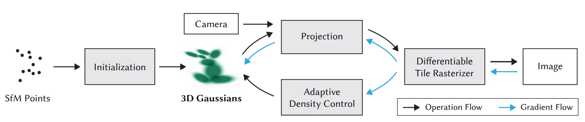

*
图源:原论文 figure.2.
*

优化流程以 SfM 得到的稀疏点云和相机位姿及位姿处拍摄的照片作为输入，每个点都被用于初始化 3D gaussians。在空间的其它位置，还会随机生成更多 gaussians，我们会采用 Adaptive Density control 来“裁剪”这些 gaussians。然后，我们将高斯球投影到某个相机位姿下的 2D 平面上，并渲染出来。渲染后将其与原图对比，计算损失函数以进一步调参，这是优化真正发生的地方。

### Stochastic Gradient Descent

研究者在优化中采用了[随机梯度下降的 Adam 算法](https://zhuanlan.zhihu.com/p/425792966)。

#### Loss Function

定义损失函数如下：

$$\mathcal{L} = (1-\lambda)\mathcal{L}_1 + \lambda \mathcal{L}_{\text{D-SSIM}}, \qquad \lambda = 0.2$$

其中

- $\mathcal{L}_1 = \big|\hat{I} - I\big|_1$ 是逐像素差的绝对值。
- [$\operatorname {SSIM}$ 指标](https://zhuanlan.zhihu.com/p/399215180)用来衡量照片的亮度 $l$ 、对比度 $c$ 和结构 $s$ 。

**SSIM指标**

$$\mathrm{SSIM}(x,y)=l(x,y)^{\alpha}\cdot c(x,y)^{\beta}\cdot s(x,y)^{\gamma}$$

$$l(x, y) = \frac{2\mu_x\mu_y + c_1}{\mu_x^2 + \mu_y^2 + c_1} \quad c(x, y) = \frac{2\sigma_x\sigma_y + c_2}{\sigma_x^2 + \sigma_y^2 + c_2} \quad s(x, y) = \frac{\sigma_{xy} + c_3}{\sigma_x\sigma_y + c_3}$$

其中

- $\mu_x$: $x$ 的像素样本均值；
- $\mu_y$: $y$ 的像素样本均值；
- $\sigma_x^2$: $x$ 的方差；
- $\sigma_y^2$: $y$ 的方差；
- $\sigma_{xy}$: $x$ 和 $y$ 的协方差；
- $c_1 = (k_1 L)^2, c_2 = (k_2 L)^2, c_3 = c_2/2$: 这两个变量用于稳定分母较小的除法运算（防止值超出计算机表达边界）；
- $L$: 像素值的动态范围（最大 - 最小）；
- 默认 $k_1 = 0.01, k_2 = 0.03$ 。

👉 SSIM loss 取值范围是 [-1, 1] ，两张照片越相似，其值越大（相同为 1 ）。为了适应损失函数取最小的原则，使用 D-SSIM： $\mathcal{L}_{\text{D-SSIM}} = 1 - \operatorname{SSIM}(\hat{I}, I)$。

???+ note "与 NeRF 的对比"

    MSE loss 就是典型的均方误差，计算像素的绝对差值，平方后加权求和。

    - NeRF 每次迭代通常随机采样一批射线，每条射线对应一个像素，然后只对这些像素算 MSE loss。但 SSIM 要用一个 2D 邻域内的像素信息来计算均值、方差、协方差等。NeRF 随机采样的射线彼此不一定相邻，无法应用 SSIM 指标。
    - 3DGS 的 gaussians 是覆盖全局的，因此损失函数可以以 MSE 为主，SSIM 为辅。

#### Learnable Parameters

梯度下降尝试优化以下四组可学习的参数：

- Gaussian 的位姿 $M$（位置 $\boldsymbol{\mu}$ + 四元数表示的朝向 $\mathbf{q}$）。
- 协方差矩阵的分解矩阵 $S$ ，表达高斯球的尺寸。
- 球谐（**SH**）函数的参数，表达颜色 $C$ （见附录）。
- 不透明度 $\alpha$。

👉 协方差矩阵 $\Sigma$ 由 $S$ 和 $\mathbf{q}$ 合成（$\Sigma = R,S,S^{\top}R^{\top}, R = R(\mathbf{q})$）。

???+ info "激活函数"

    为了保证参数的合法性，这几个无约束的优化变量需要通过相应的激活函数来映射到合法参数。

    | 参数 | 约束 | 激活 |
    |:----:|:---:|:----:|
    | $S$ | 半轴长需 $>0$ | $s = e^{\text{raw}}$，恒正 |
    | $\alpha$ | 不透明度 $\in(0,1)$ | 使用[Sigmoid函数](https://blog.csdn.net/hy592070616/article/details/120617176)：$\alpha = \text{sigmoid}(\text{raw})$ |
    | $\mathbf{q}$ | 必须是**单位**四元数 | 归一化 |

👉 这些参数的初始值有些是从 SfM 点云中读取或算出的，有些是人为设置的。

#### More on Gradient Descent

请注意，整个梯度下降的优化发生在最后的 2D 坐标系中，因此我们所调参的协方差矩阵 $\Sigma$ 最终服务于 $\Sigma'$ 的优化。而我们已经知道，$s$ 和 $\mathbf q$ 是 $\Sigma$ 的隐式参数，因此在计算梯度的时候，需要用到链式法则。

$$\frac{\partial L}{\partial q} = \frac{\partial L}{\partial \Sigma'} \cdot \frac{\partial \Sigma'}{\partial q} \quad ; \quad \frac{\partial \Sigma'}{\partial q} = \frac{\partial \Sigma'}{\partial \Sigma} \frac{\partial \Sigma}{\partial q}$$

$\frac{\partial \Sigma}{\partial s}​$ 反映了 $\Sigma$ 如何随着拉伸参数 $s$ 改变而改变。

$$\frac{\partial L}{\partial s} = \frac{\partial L}{\partial \Sigma'} \cdot \frac{\partial \Sigma'}{\partial s} \quad ; \quad \frac{\partial \Sigma'}{\partial s} = \frac{\partial \Sigma'}{\partial \Sigma} \frac{\partial \Sigma}{\partial s}$$

$\frac{\partial \Sigma}{\partial q}​$ 反映了 $\Sigma$ 如何随着旋转参数 $\mathbf{q}$ 改变而改变。

💡 直接计算$\frac{\partial \Sigma}{\partial s}​$ 和 $\frac{\partial \Sigma}{\partial q}​$ 可以快速计算出 scaling 和 rotating 的梯度，允许了高效的反向传播（这两个梯度存在闭式解，$s$ 和 $\mathbf q$ 改变后不需要重新推导梯度，只需代入闭式解的公式即可）.

???+ note "小结"

    与 NeRF 优化神经网络权重不同，在 3DGS 里，我们优化的是场景本身（每个高斯的参数）。研究者把显示的几何语言当作可学习参数直接做梯度下降，这得益于整条高斯优化 pipeline 的可微性。

    $$\frac{\partial \mathcal{L}}{\partial \boldsymbol{\mu}},\ \frac{\partial \mathcal{L}}{\partial S},\ \frac{\partial
    \mathcal{L}}{\partial \mathbf{q}},\ \frac{\partial \mathcal{L}}{\partial \alpha},\ \frac{\partial \mathcal{L}}{\partial \text{SH}}$$

理解了整条 optimization pipeline 的基本流程，我们就可以深入一个问题——

### Adaptive Density Control

!!! bug "梯度下降不能做到什么？"

    *Our optimization needs to be able to create geometry and also destroy or move geometry if it has been incorrectly positioned.*

    梯度下降只能通过调参来移动/调整已有的高斯，但它不能够创建/消灭高斯，因此有些问题单靠梯度下降是无法解决的。大概分这两类：

    - 由于物理世界的复杂性，初始 SfM 点云可能分布不均或存在噪声，仅凭由点云初始化的高斯无法弥补细节的不足。
    - 随着优化的进行，有些高斯会变得完全透明或者变得异常巨大。这些高斯对最终渲染没有贡献，反而会拖慢训练和渲染速度。

    因此，必须额外进行**拓扑层面**的操作.

Adaptive Density Control 是研究者提出的一种调整方式，在梯度下降的同时，动态调整 Gaussians 的数量、密度和参数。

#### When to control?

*we densify Gaussians with an average magnitude of view-space position
gradients above a threshold 𝜏pos, which we set to 0.0002 in our tests.*

研究者使用平均视图空间位置梯度 (Average View-Space Positional Gradient)来判断是否进行密度控制，超过阈值 $\tau_{\text{pos}}$ 就触发。

每 100 次迭代中，算法会追踪透明度、高斯大小、每个高斯在 2D 屏幕空间上投影的位置梯度的模长等参数，并对不同问题针对性地进行调整。

位置梯度模长：

$$\Big|\ \nabla_{\boldsymbol{\mu}} \mathcal{L}\ \Big| \quad\text{（在视空间/屏幕空间上度量）}$$

> - 位置梯度大表明高斯原来的位置不够准确，它希望挪动位置。
> - 采用屏幕空间而非世界空间的位置梯度，是因为我们最终在意的是屏幕上的误差。
> - 通过取平均值（累计梯度之和/迭代次数），减小噪音影响。

Density Control 主要包含以下两种操作——

#### Pruning

如果高斯的透明度过小 $\alpha < \epsilon_{\alpha}$ ，或者尺寸过大（屏幕投影/世界尺度），就将其删除。

???+ info "**Opacity Reset**"

    每隔 $N$ 次迭代，把所有高斯的 $\alpha$ 压低到接近 0。

    👉 这是为了防止优化局限于相机附近的漂浮物 (floater) 上导致高斯数量失控增长。高斯不透明度重置后，优化必须重新把 $\alpha$ 提上来，否则就会被 pruning 删除。

#### Densification

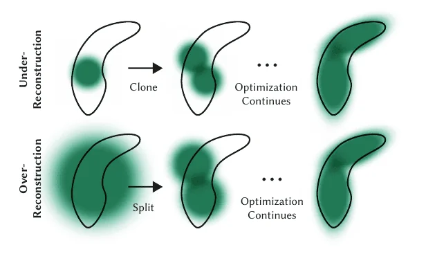

*
图源:原论文 figure.11. Visualization of Densification
*

这一步主要解决两种问题：

**Over-reconstruction**

当 3D 场景的一个区域被过大或相互重叠的高斯表示时，我们通过 **Split** 操作，用两个更小的高斯来表示这片区域。

**Under-reconstruction**

当 3D 场景的一个区域缺乏足够的高斯来覆盖、几何细节丢失时，我们通过 **Clone** 操作，我们将这个区域的高斯复制一份或多份，沿位置梯度方向做偏移，提高该处的高斯密度。

    if  max(S) ≤ percent_dense × scene_extent   →  Clone   （高斯小）

    else                                         →  Split   （高斯大）

### Training Pipeline

最后，我们总结一下整个 Optimization 的流程。

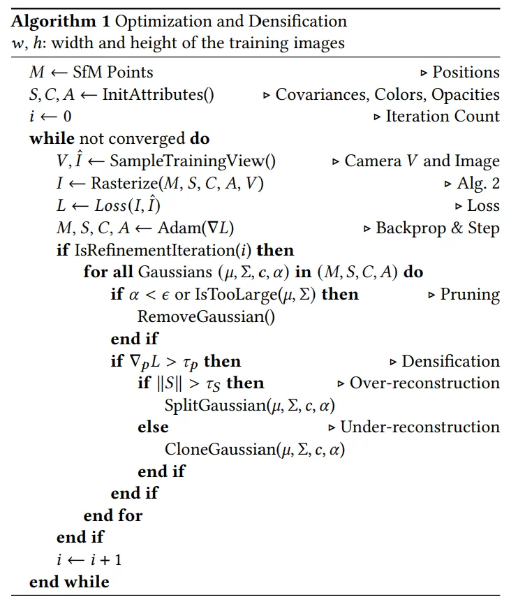

*
图源:原论文 Algorithm.1.
*

这段伪代码已经写的十分清晰了，如果上面的都顺着捋下来了，应该很容易看懂。

## Fast Differentiable Rasterizer For Gaussians

我们此前在 Projection 小节中已经讲述了从数学结构如何把 3D Gaussians 投影到 2D 屏幕上（2D Gaussians），接下来我们深入渲染过程的细节，把连续的几何图形转变为屏幕上离散的像素。这一过程被称作“光栅化”(Rasterization)。
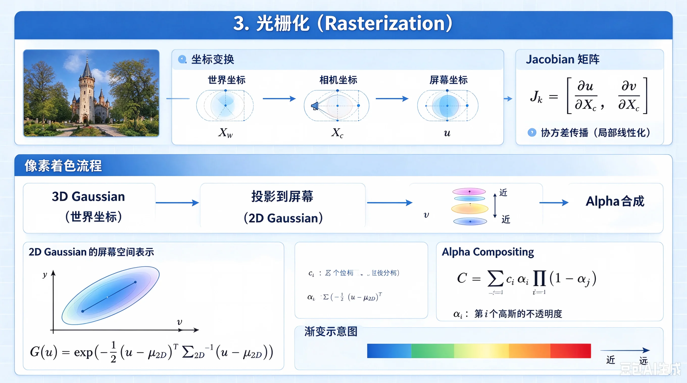

*
AI生成：光栅化
*

### Rendering

到现在为止，我们已经获得了投影后每个 **2D 高斯**的结构 $(\boldsymbol{\mu}',\Sigma')$ 、**3D 高斯**的颜色 $\mathbf{c}$ 以及不透明度 $\alpha$ 。我们需要用它们来合成图片。

核心的渲染公式如下：

$$C = \sum_{i\in\mathcal{N}} c_i \alpha_i \prod_{j=1}^{i-1}(1-\alpha_j) \quad (\text{颜色 × 权重})$$

- $C$：最终渲染出的像素颜色（RGB 向量）。
- $N$：参与该像素渲染的所有 3D 高斯的集合,这些高斯按照距离相机的远近进行排序（从近到远）。
- $i$：当前正在计算的第 i 个高斯。
- $\alpha_i$ = 该高斯的不透明度 × 2D 高斯值 $G(p) = \exp\left( -\frac{1}{2} (p - \mu_{2D})^T \Sigma_{2D}^{-1} (p - \mu_{2D}) \right)$ （表示屏幕上像素 $p(x,y)$ 处分到的权重）。
- $\prod_{j=1}^{i-1}(1-\alpha_j)$：透射率（Transmittance），表示光线从远到近，穿过前面的高斯抵达该高斯的概率。

!!! warning "一个难点"

    3DGS 的渲染公式与体渲染和 NeRF 的渲染公式都是同构的，然而根据公式，想要实现渲染，我们需要对所有 3D 高斯进行排序，并能够多像素并行地进行渲染。

研究者对此设计了一套步骤：

**Culling**

对于完全位于相机视锥之外或处于极端位置的高斯，它们的贡献可以忽略不计，我们将其裁剪掉。

**Projection**

将 3D Gaussians 投影到 2D Gaussians，得到 2D 的位姿 $M$ 和 缩放矩阵 $S$ 。

**Tiling**

将屏幕切分成 $16 \times 16$ 的 **tile** 。

**Duplicate**

把每个高斯按照其 2D 投影分配到相关的 **tile**，并为每个高斯分布分配一个用于排序的key（结合深度和 **tile** 的 ID）。若某个高斯的投影横跨多个 **tile**，则为每个 **tile** 都复制一份这个高斯。

**Sort**

基于每个高斯的深度和 **tile** ID，用 GPU 完成 [radix sort](https://en.wikipedia.org/wiki/Radix_sort)。这样就并行地在每个 **tile** 内部实现了高斯的排序，不需要做全局排序。

**Blend**

每个线程在各自的 **tile** 内逐像素遍历排序后的高斯，从前往后累加：颜色按 $c_i\alpha_i$ 加权并乘上相应位置的透射率，最终得到像素的颜色。

### Pipeline

总结一下整个渲染流程：

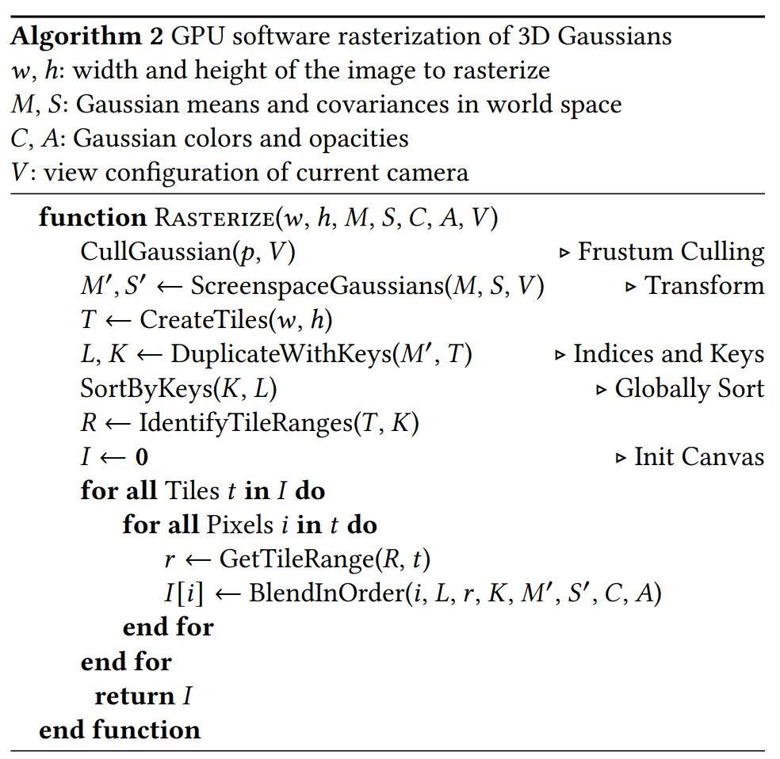

*
图源：原论文 Algorithm.2.
*

整条光栅化链都是可微的 → 梯度沿
$\frac{\partial\mathcal{L}}{\partial \boldsymbol{\mu}'},\ \frac{\partial\mathcal{L}}{\partial \Sigma'},\ \frac{\partial\mathcal{L}}{\partial \alpha},\ \frac{\partial\mathcal{L}}{\partial \mathbf{c}}$
回传，再经链式法则回到 $\boldsymbol{\mu},\mathbf{q},S,\alpha,\text{SH}$。

   

# 评论区

