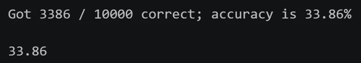

# Assignment 1：Pytorch Basics & kNN Classifier

A1 includes 2 questions:

**Q1: PyTorch 101**. Walk you through the basics of working with tensors in PyTorch.

**Q2: k-Nearest Neighbor classifier**. Walk you through implementing a kNN classifier. 

>这里整理了一些常用的 pytorch 语法和我做 assignment 的 debug 经历。

---

## PyTorch 基本语法

>本文关于pytorch语法的一些阐述较为简略，要了解更多信息请查阅[这个工具书](https://docs.pytorch.org/docs/2.14/torch.html)，里面记录了pytorch详尽的api接口。
### 1. Tensor Basics

#### 1.1 创建、访问与形状

| 用法 | 作用 |
| --- | --- |
| `import torch`、`torch.__version__` | 导入 PyTorch、查看版本 |
| `torch.tensor(data)` | 从列表或嵌套列表创建张量 |
| `x.dim()`、`x.ndim` | 维度数量（rank） |
| `x.shape`、`x.size()` | 各维度大小；`x.size(d)` 获取第 `d` 维大小 |
| `x[i]`、`x[i, j]` | 取元素；下标从 0 开始，结果仍是 Tensor |
| `x[i, j] = value` | 原地修改元素 |
| `x.item()` | 将单元素 Tensor 转为 Python 标量 |
| `x.tolist()` | Tensor 转为 Python 标量或嵌套列表 |
| `torch.is_tensor(x)` | 判断是否为 Tensor |

#### 1.2 张量构造函数

| 用法 | 作用 |
| --- | --- |
| `torch.zeros(M, N)` | 全 0 |
| `torch.ones(M, N)` | 全 1 |
| `torch.eye(n)` | 单位矩阵 |
| `torch.rand(M, N)` | `[0, 1)` 均匀分布随机数 |
| `torch.randn(M, N)` | 标准正态分布随机数 |
| `torch.full((M, N), fill_value=v)` | 指定形状，值全部填为 `v` |

#### 1.3 数据类型

| 用法 | 作用 |
| --- | --- |
| `x.dtype` | 查看元素类型 |
| `torch.tensor(data, dtype=...)` | 创建时指定类型 |
| `x.to(dtype)` | 转换类型 |
| `x.float()`、`x.double()`、`x.long()` | 转为 `float32`、`float64`、`int64` |
| `torch.zeros_like(x)` | 与 `x` 同形状、同类型、同设备的全 0 张量 |
| `x.new_zeros(M, N)` | 指定新形状，继承 `x` 的类型和设备 |
| `x.to(other)` | 匹配另一个 Tensor 的类型和设备 |
| `torch.arange(start, end, step, dtype=...)` | 等差数列，包含 `start`，不包含 `end` |

- 常用数据类型：`float32`（计算）、`float64`（双精度）、`int64`（整数／索引）、`bool`（掩码）、`float16`（半精度）；另有 `int16`、`int32`、`uint8`。

### 2. Tensor Indexing

#### 2.1 切片索引

| 用法 | 作用 |
| --- | --- |
| `x[start:stop:step]` | 左闭右开，默认步长为 1 |
| `x[:k]`、`x[k:]`、`x[:]` | 前 `k` 项、从 `k` 起、全部 |
| `x[-1]`、`x[:-1]` | 最后一项、排除最后一项 |
| `x[::2]` | 每隔一项取一项 |
| `x[i, :]`、`x[i]` | 第 `i` 行，整数索引会去掉该维度 |
| `x[i:i+1, :]` | 单行切片，保留该维度 |
| `x[:, j:j+1]` | 单列切片，保留形状 `(M, 1)` |
| `x[:2, :3]` | 前两行、前三列 |
| `x[::2, 1::2]` | 偶数下标行、奇数下标列 |
| `x.clone()` | 复制数据，修改副本不影响原张量 |
| `x[:, :2] = v` | 原地给切片赋值；右侧可为标量或形状兼容的 Tensor |

- 基本切片返回共享数据的 **view**，修改切片会影响原张量。需要独立数据时要 `clone()`。

#### 2.2 整数数组索引

| 用法 | 作用 |
| --- | --- |
| `x[rows]`、`x[:, cols]` | 按指定顺序选行／列，可重复；索引可用整数列表或 `int64` Tensor |
| `x[rows, cols]` | 等长一维索引逐对取元素：第 `k` 项为 `x[rows[k], cols[k]]` |
| `x[rows, cols] = v` | 原地修改指定位置 |
| `torch.arange(n)` | 创建索引 `0, 1, ..., n - 1` |

- 整数数组索引读取返回新数据，通常无需再 `clone()`。
- 索引赋值仍会修改原张量。

#### 2.3 布尔索引

| 用法 | 作用 |
| --- | --- |
| `mask = x > 0` | 逐元素比较，得到同形状 `bool` Tensor |
| `x[mask]` | 同形状掩码筛选出真值位置，结果是一维 Tensor |
| `x[x <= 3] = 0` | 原地修改满足条件的元素 |
| `torch.manual_seed(seed)` | 设置随机种子，便于复现随机测试 |

### 3. Reshaping Operations

#### 3.1 View

| 用法 | 作用 |
| --- | --- |
| `x.view(M, N)` | 在元素总数不变的前提下改变形状，共享原数据 |
| `x.view(-1)` | 展平为一维 |
| `x.view(1, -1)`、`x.view(-1, 1)` | 转为二维行向量／列向量 |

- `-1` 表示自动推断该维大小，一次最多使用一个。
- 改变形状不会交换轴，因为`.view()`始终按维度顺序读取，因此不能直接实现矩阵转置。

#### 3.2 交换轴

| 用法 | 作用 |
| --- | --- |
| `x.t()`、`torch.t(x)` | 二维矩阵转置 |
| `x.transpose(a, b)`、`torch.transpose(x, a, b)` | 交换指定的两个维度 |
| `x.permute(1, 2, 0)` | 按指定顺序重排全部维度；新轴依次来自旧轴 1、2、0 |

- 这些操作通常共享原数据，只改变形状和访问方式。

#### 3.3 连续性与 Reshape

| 用法 | 作用 |
| --- | --- |
| `x.contiguous()` | 得到连续布局；已连续时返回自身，否则复制 |
| `x.reshape(M, N)` | 改变形状；能共享数据时返回 view，否则复制 |
| `x.transpose(a, b).contiguous().view(...)` | 交换轴后，先整理连续布局，再改变形状 |

- `view` 要求形状与底层步长兼容；转置后的非连续 Tensor 常无法直接 `view`。`reshape` 会在必要时复制，**但并非总是深拷贝**。

### 4. Tensor Operations

#### 4.1 逐元素运算

| 运算 | 等价写法 |
| --- | --- |
| 加法 | `x + y`、`torch.add(x, y)`、`x.add(y)` |
| 减法 | `x - y`、`torch.sub(x, y)`、`x.sub(y)` |
| 乘法 | `x * y`、`torch.mul(x, y)`、`x.mul(y)` |
| 除法 | `x / y`、`torch.div(x, y)`、`x.div(y)` |
| 幂 | `x ** y`、`torch.pow(x, y)`、`x.pow(y)` |
| 平方根 | `torch.sqrt(x)`、`x.sqrt()` |
| 三角函数 | `torch.sin(x)`／`x.sin()`、`torch.cos(x)`／`x.cos()` |
| 绝对值 | `torch.abs(x)`、`x.abs()` |

- `*` 是逐元素乘法；矩阵乘法要使用 `@` 或相应函数。

#### 4.2 归约运算

| 用法 | 作用 |
| --- | --- |
| `x.sum()`、`torch.sum(x)` | 全部元素求和，返回标量 Tensor |
| `x.sum(dim=d)` | 沿第 `d` 维求和，默认删除该维度 |
| `x.mean(dim=d)` | 沿指定维度求均值，输入需为浮点或复数 |
| `x.min()`、`x.max()` | 全局最小／最大值 |
| `values, indices = x.min(dim=d)` | 返回该维最小值及其在该维的下标；`max` 同理 |
| `x.argmin(dim=d)` | 只返回最小值下标；并列时返回第一个 |
| `x.sum(dim=d, keepdim=True)` | 保留该维度，大小变为 1；其他归约函数也可用 |
| `x.all()` | 所有布尔元素是否都为真 |

- 对 `(M, N)`：`dim=0` 消去行轴，得到每列结果 `(N,)`；`dim=1` 消去列轴，得到每行结果 `(M,)`。

#### 4.3 向量与矩阵运算

| 用法 | 输入／输出 |
| --- | --- |
| `torch.dot(v, w)` | `(N,)` 与 `(N,)` → 标量内积 |
| `torch.mm(x, y)` | `(N, M)` 与 `(M, P)` → `(N, P)`，不广播 |
| `torch.mv(x, v)` | `(N, M)` 与 `(M,)` → `(N,)` |
| `torch.addmm(b, x, y, beta=1, alpha=1)` | `beta * b + alpha * (x @ y)` |
| `torch.addmv(b, x, v, beta=1, alpha=1)` | `beta * b + alpha * (x @ v)` |
| `torch.bmm(x, y)` | `(B, N, M)` 与 `(B, M, P)` → `(B, N, P)`，batch 数须相同，不广播 |
| `torch.baddbmm(b, x, y, beta=1, alpha=1)` | `beta * b + alpha * bmm(x, y)` |
| `torch.matmul(x, y)`、`x @ y` | 通用乘法；按维度处理向量／矩阵，高维输入可广播 batch 维 |
| `torch.stack(tensors, dim=0)` | 同形状张量沿新维度堆叠 |

### 5. Broadcasting

#### 5.1 广播规则

从末尾对齐两个张量的各维度，如果两张量维数不同，则对维数较小的张量往左边补一个大小为 1 的维度。重复此操作，直到两个张量维数一致，并且各维度的大小须相等或其中一个为 1。大小为 1 的维度可通过 copy 扩展到另一张量对应维度的大小（一种假设，并没有实际复制数据）。

| 用法 | 作用 |
| --- | --- |
| `x + v`，`x: (M, N)`、`v: (N,)` | 给每行加同一个向量 |
| `x + w.view(-1, 1)`，`w: (M,)` | 给每列加同一个列向量 |
| `v.view(-1, 1) * w`，`v: (N,)`、`w: (M,)` | 生成外积 `(N, M)` |
| `c.view(-1, 1, 1) * x`，`c: (B,)`、`x: (M, N)` | 用不同常数缩放同一矩阵，输出 `(B, M, N)` |
| `v.repeat((M, 1))` | 实际复制数据，得到多行；区别于广播 |
| `torch.broadcast_tensors(x, v)` | 返回可共同广播的视图；可能有多个位置共享同一元素，避免原地写入 |

#### 5.2 原地操作

| 用法 | 行为 |
| --- | --- |
| `z = x.add(y)`、`z = x + y` | 新结果，输入不变 |
| `x.add_(y)`、`x += y` | 修改 `x` |
| `torch.add(x, y, out=x)` | 把结果写入 `x` |
| `z is x` | 判断是否是同一 Python 对象，不是比较数值 |

- 方法名末尾的 `_` 通常表示原地操作；`out=` 可将结果写入指定位置。

👉 原地修改在深度学习中可能会影响后续的梯度计算，因此我们最好使用能产生新结果的函数。

### 6. Running on GPU

| 用法 | 作用 |
| --- | --- |
| `torch.cuda.is_available()` | 检查 CUDA 是否可用 |
| `x.device`、`torch.device('cpu')` | 查看／表示设备 |
| `x.to('cuda')`、`x.cuda()` | 返回 GPU 上的张量 |
| `x.to('cpu')`、`x.cpu()` | 返回 CPU 上的张量 |
| `torch.tensor(data, device='cuda', dtype=...)` | 创建时指定设备和类型；其他构造函数也可用 |
| `x.to(other)` | 同时匹配另一个张量的设备与类型 |
| `torch.cuda.synchronize()` | 等待 GPU 操作完成，计时前后需要同步 |

- GPU 运算通常要求参与运算的 Tensor 在同一设备，而新建 Tensor 默认在 CPU，需要指定设备或跨设备搬运数据（开销较大）。

### 7. Challenge

#### 7.1 各不等长张量的均值

**语法**

| 用法 | 作用 |
| --- | --- |
| `torch.cat(xs, dim=0)` | 沿已有维度拼接，得到一维长向量；不同于 `stack` 新增维度 |
| `torch.repeat_interleave(ids, ls, dim=0)` | 将 `ids[i]` 连续重复 `ls[i]` 次 |
| `base.scatter_add(d, idx, src)` | 将 `src[j]` 的元素逐个加到`base`，累加位置由`idx`的值和`src`的索引共同决定。累加位置在`dim=d`维度，取`idx[src的索引]`的值；在`dim≠d`的维度取src在`dim≠d`的对应索引 |

**实现逻辑**

1. `tmp = cat(xs)`：把各张量首尾拼接。
2. 用 `arange(N)` 生成组号，再通过`torch.repeat_interleave()`按长度 `ls` 重复。例如： `ls=[3, 2]` 得到 `idx=[0, 0, 0, 1, 1]`。
3. 在长度为 `N` 的全 0 张量中，通过`scatter_add` 将`tmp`按组号累加，得到每组总和。
4. 逐元素除以 `ls`，得到形状 `(N,)` 的均值。

```py title="challenge_mean_tensors" linenums="1"
tmp=torch.cat(xs)
idx=torch.repeat_interleave(torch.arange(len(xs),device=tmp.device),ls,dim=0)
y=torch.zeros(len(xs),device=tmp.device,dtype=tmp.dtype).scatter_add(0,idx,tmp) / ls
```

#### 7.2 不同数值及首次出现位置

**语法**

| 用法 | 作用 |
| --- | --- |
| `values, indices = x.sort(stable=True)` | 排序并返回原始下标；稳定排序保留相等元素的原有顺序 |
| `values[1:] != values[:-1]` | 比较相邻元素，标记数值发生变化的位置 |
| `torch.cat([first, mask])` | 给相邻比较结果补上首元素的标记 |
| `values[mask]`、`indices[mask]` | 用同一掩码选择数值及对应原始下标 |
| `torch.unique(x)` | 获取不同数值；本题允许使用，但只给半分 |

**实现逻辑**

1. 稳定排序，使相等数值相邻；同值中原始下标最小者排在最前。
2. 比较相邻数值，在掩码头部补 `True`，保留每段的第一个元素。
3. 同步筛选排序值和原始下标，得到升序 `uniques` 及首次出现位置 `indices`。

```py title="challenge_get_uniques" linenums="1"
value,idx=x.sort(stable=True)
mask=(value[1:]!=value[:-1])
mask=torch.cat([torch.tensor([True],device=x.device),mask])
uniques=value[mask]
indices=idx[mask]
```

## kNN 分类器

```title="伪代码"
Input:
    X_train: Training samples (N × D)
    y_train: Training labels (N)
    X_test:  Test samples (M × D)

Output:
    y_pred: Predicted labels (M)

Training:
    Store X_train and y_train

Prediction:
    Initialize y_pred

    for i = 1 to M do
        for j = 1 to N do
            dist[j] ← Σ(k=1 to D) |X_train[j,k] - X_test[i,k]|
        end for

        min_index ← argmin(dist)
        y_pred[i] ← y_train[min_index]
    end for

    return y_pred
```

### 距离计算函数

计算每个 test image 与每个 train image 之间的距离，返回一个二维张量。其中距离的计算方法是图片张量之间的** 2 范数的平方**。

**函数接口**

```py linenums="1"
def compute_distances(x_train: torch.Tensor, x_test: torch.Tensor):
    """
    Computes the squared Euclidean distance between each element of training
    set and each element of test set. Images should be flattened and treated
    as vectors.

    Args:
        x_train: Tensor of shape (num_train, C, H, W)
        x_test: Tensor of shape (num_test, C, H, W)

    Returns:
        dists: Tensor of shape (num_train, num_test) where dists[i, j] is
            the squared Euclidean distance between the i-th training point and
            the j-th test point.
    """
    # Initialize dists to be a tensor of shape (num_train, num_test) with the
    # same datatype and device as x_train
    num_train = x_train.shape[0]
    num_test = x_test.shape[0]
    dists = x_train.new_zeros(num_train, num_test)

    """ implementation """

    return dists
```

#### two loops implementation

```py linenums="1"
for i in range(num_train):
    train=x_train[i,...].reshape([-1])
    for j in range(num_test):
        test=x_test[j,...].reshape([-1])
        dists[i,j]=((train-test)**2).sum().item()
```

#### one loop implementation

```py linenums="1"
for i in range(num_train):
    train=x_train[i,...].reshape(-1)
    test_pack=x_test.reshape(num_test,-1)
    dists[i]=((test_pack-train)**2).sum(dim=1)
```

#### no loop implementation

一开始，我的想法是直接通过一次广播来实现向量化计算。

```py title="v1" linenums="1"
train_pack = x_train.reshape(num_train, 1, -1) #把两个数据集都扩充成三维，让形状匹配
test_pack = x_test.reshape(1, num_test, -1)
dists = ((train_pack - test_pack)**2).sum(dim=2) #沿第二个维度计算欧氏距离的平方
```

然而，这段代码虽然正确性通过了，但 `no loop` 的计算时间相比 `one loop`竟然增长了。在`dist`的计算过程中，产生了巨大的`(num_train, num_test, D)`大小的三位张量，超出了题目的内存限制，内存压力过大导致性能下降。

后来，我回归题目所给的提示，将距离公式展开：

$$ ( \mathbf{u} - \mathbf{v})^2 = \mathbf{u}^2 + \mathbf{v}^2 - 2 \mathbf{u}^{\top} \mathbf{v} $$

通过两次`sum()`和一次`matrix multiplication`组合成最终结果。

```py title="v2" linenums="1"
train=x_train.reshape(num_train,-1)
test=x_test.reshape(num_test,-1)
sum_train=(train**2).sum(dim=1).reshape(num_train,1) # u^2
sum_test=(test**2).sum(dim=1).reshape(1,num_test) # v^2
dists=sum_train-2*torch.mm(train,test.t())+sum_test
```

#### 对比


可以看到，对比 python 循环，向量化大大提高了计算性能。

### 预测函数

基于测试图与各训练图之间的距离，找到最近的 k 个邻居，投票选出一个类别（label），将它作为对测试图 label 的预测结果。

**函数接口**

```py linenums="1"
def predict_labels(dists: torch.Tensor, y_train: torch.Tensor, k: int = 1):
    """
    Given distances between all pairs of training and test samples, predict a
    label for each test sample by taking a MAJORITY VOTE among its `k` nearest
    neighbors in the training set.

    In the event of a tie, this function SHOULD return the smallest label. For
    example, if k=5 and the 5 nearest neighbors to a test example have labels
    [1, 2, 1, 2, 3] then there is a tie between 1 and 2 (each have 2 votes),
    so we should return 1 since it is the smallest label.

    This function should not modify any of its inputs.

    Args:
        dists: Tensor of shape (num_train, num_test) where dists[i, j] is the
            squared Euclidean distance between the i-th training point and the
            j-th test point.
        y_train: Tensor of shape (num_train,) giving labels for all training
            samples. Each label is an integer in the range [0, num_classes - 1]
        k: The number of nearest neighbors to use for classification.

    Returns:
        y_pred: int64 Tensor of shape (num_test,) giving predicted labels for
            the test data, where y_pred[j] is the predicted label for the j-th
            test example. Each label should be an integer in the range
            [0, num_classes - 1].
    """
    num_train, num_test = dists.shape
    y_pred = torch.zeros(num_test, dtype=torch.int64)

    """ implementation """

    return y_pred
```

#### v1

一开始想的比较简单，想直接通过`torch.unique`获取 k 个邻居的 label 和各自出现的次数，保留次数最大的那个。

```py title="version 1" linenums="1"
value,idx = dists.sort(dim=0,stable=True) #sort the distance matrix along each column(test image)
unique,counts = torch.unique(value[:k,:],dim=0,return_counts=True) # return the unique and counts for k "distance"!
max,max_idx = counts.max(dim=0) # find the maximum counts of unique distances
y_pred = y_train[idx[max_idx,torch.arange(num_test)]]
```

然而这里有个逻辑问题，我这里是对**距离**做了投票，真正要投票的是每个`train_image`对应的 **label** ！

#### v2

基于 v1 ，我修正了 label 的投票逻辑，对 label 而不是 dist 进行计数。

```py title="version 2" linenums="1"
value,idx=dists.sort(dim=0,stable=True)
for i in range(num_test): # traverse each test image,
    label = y_train[idx[:k, i]] # get the label of first k train images
    unique, counts = torch.unique(label, return_counts=True) # count the appearance of each unique label
    max_idx = counts.argmax() # get the index of the predicted label
    y_pred[i] = unique[max_idx]
```

为了理清逻辑，我使用了一个循环。

#### v3

我尝试沿这一路径化简循环，希望将函数完全向量化以提高运行速度。

```py title="version 3" linenums="1"
value,idx=dists.sort(dim=0,stable=True)
label = y_train.repeat(num_test, 1).t()[idx[:k, :]] # expand the label vector to (num_train,num_test) matrix
unique, counts = torch.unique(label, dim=0, return_counts=True) # vote labels of each test image along dimension 0.
max_idx = counts.argmax()
y_pred = unique[max_idx, torch.arange(num_test)].reshape(num_test)
```

然而我没有考虑到的是，在 pytorch 的语法中，`torch.unique()`按某一维度操作时，它实际上是**把其它维度打包起来**作比较。因此第 3 行的 `torch.unique` 实际比较的是`k`个长度为`num_test`的向量，而不是对每个`test image`单独比较它的`k`个 label。这就造成了整体的逻辑错误。

另外，还有一个隐蔽的语法错误，在第 2 行中，我对形如`(num_train,num_test)`的二维矩阵索引时只给出第一个维度的索引，这会将原张量的 0 维扩展成 0 维索引矩阵的形状，同时保留原张量的 1 维。最后它会返回一个三维张量，多了一个大小为 `num test` 的维度，因此 `torch.unique()` 比较的其实是形状为 (num_test,num_test) 的向量，得到的`unique`也将是三维张量。最后通过`unique[]`引用时又只给出了前两个维度，保留了第三个维度，得到形如`(num_test,num_test)`的二维张量，而它无法被`reshape`成长度为`num_test`的向量，解释器会报错。

报错信息如下：

```py
RuntimeError shape '[3]' is invalid for input of size 9
```

#### v4

`unique()`的设计决定了沿上述路径实现向量化比较困难，于是我们换一种思路，用在 pytorch 练习中遇到过的`torch.scatter_add()`来模拟投票逻辑。

```py title="version 4" linenums="1"
value,idx=dists.sort(dim=0,stable=True)
label=y_train.repeat(num_test,1).t()[idx[:k,:],torch.arange(num_test)] # index the label correctly
num_classes=max(y_train)+1 #计算label总数
count=torch.zeros(num_classes,num_test) # 创建“投票箱”
vote=torch.ones(k,num_test) # 每个test image所对应的k个邻居各有1票
count=count.scatter_add_(0,label,vote) # 把vote中的所有选票按label确定的类别投到count中。赋值位置的0维度由label[vote_index0,vote_index1]决定，1维度取vote_index2，契合投票逻辑。
y_pred=count.argmax(dim=0) #找到count矩阵每列最大（投票最多）的0维索引，对应的就是要预测的label值。
```

### kNN 类

最重要的两个函数已经实现了，接下来需要实现完整的 kNN 类，实现距离计算、预测、准确率的计算等。

#### k 的选择

在 kNN 的内部还需实现对于超参数 k 的选择，这对于预测的准确度有一定的影响。这是对于不同 k 预测的可视化图像。

<table align="center" style="border: none;">
  <tr>
    <td align="center" style="border: none; padding: 0 5px;">
      
      <br>
      <span style="font-size: 12px; color: #666;"></span>
    </td>
    <td align="center" style="border: none; padding: 0 5px;">
      
      <br>
      <span style="font-size: 12px; color: #666;"></span>
    </td>
    <td align="center" style="border: none; padding: 0 5px;">
      
      <br>
      <span style="font-size: 12px; color: #666;"></span>
    </td>
  </tr>
</table>

课程给出的方法是将训练集划分成多个 folds，一个fold作为选择 k 的验证集（也就是在选择k的过程中用来作为测试集的数据），其它作为训练集。

整体函数逻辑比较简单，就是对于每个可供选择的 k 值，跑`num_folds`轮训练，每次都把其中一个 fold 作为验证集，其它作为训练集。

**函数接口 1**

```py linenums="1"
def knn_cross_validate(
    x_train: torch.Tensor,
    y_train: torch.Tensor,
    num_folds: int = 5,
    k_choices: List[int] = [1, 3, 5, 8, 10, 12, 15, 20, 50, 100],
):
    """
    Perform cross-validation for `KnnClassifier`.

    Args:
        x_train: Tensor of shape (num_train, C, H, W) giving all training data.
        y_train: int64 Tensor of shape (num_train,) giving labels for training
            data.
        num_folds: Integer giving the number of folds to use.
        k_choices: List of integers giving the values of k to try.

    Returns:
        k_to_accuracies: Dictionary mapping values of k to lists, where
            k_to_accuracies[k][i] is the accuracy on the i-th fold of a
            `KnnClassifier` that uses k nearest neighbors.
    """

    # First we divide the training data into num_folds equally-sized folds.
    x_train_folds = []
    y_train_folds = []
    x_train_folds=x_train.chunk(num_folds)
    y_train_folds=y_train.chunk(num_folds)

    # A dictionary holding the accuracies for different values of k that we
    # find when running cross-validation. After running cross-validation,
    # k_to_accuracies[k] should be a list of length num_folds giving the
    # different accuracies we found trying `KnnClassifier`s using k neighbors.
    k_to_accuracies = {}

    return k_to_accuracies
```

**实现逻辑 1**

两个循环即可，需要一些列表和字典的操作。

```py linenums="1"
for k in k_choices:
    accuracy=list()
    for i in range(num_folds):
        x_folds=list(x_train_folds)
        y_folds=list(y_train_folds)
        del x_folds[i],y_folds[i]
        x_folds=torch.cat(x_folds)
        y_folds=torch.cat(y_folds)
        accuracy.append(KnnClassifier(x_folds,y_folds).check_accuracy(x_train_folds[i],y_train_folds[i],k))
    k_to_accuracies.update({k:accuracy})
```

然后通过计算每个 k 的一组准确率的均值，比较后找到准确率最高的 k。

**函数接口 2**

```py linenums="1"
def knn_get_best_k(k_to_accuracies: Dict[int, List]):
    """
    Select the best value for k, from the cross-validation result from
    knn_cross_validate. If there are multiple k's available, then you SHOULD
    choose the smallest k among all possible answer.

    Args:
        k_to_accuracies: Dictionary mapping values of k to lists, where
            k_to_accuracies[k][i] is the accuracy on the i-th fold of a
            `KnnClassifier` that uses k nearest neighbors.

    Returns:
        best_k: best (and smallest if there is a conflict) k value based on
            the k_to_accuracies info.
    """
    best_k = 0

    """implementation"""

    return best_k
```

**实现逻辑 2**

```py linenums="1"
accuracies=list(k_to_accuracies.values())
mean=list()
for i in range(len(k_to_accuracies)):
    mean.append(sum(accuracies[i])/len(accuracies[i]))
idx=mean.index(max(mean))
best_k=list(k_to_accuracies.keys())[idx]
```

#### 整体框架

```py linenums="1"
class KnnClassifier:
    def __init__(self, x_train: torch.Tensor, y_train: torch.Tensor):
        self.x_train = x_train
        self.y_train = y_train

    def predict(self, x_test: torch.Tensor, k: int = 1):
        dists = compute_distances_no_loops(self.x_train, x_test)
        return predict_labels(dists, self.y_train, k)

    def check_accuracy(
        self,
        x_test: torch.Tensor,
        y_test: torch.Tensor,
        k: int = 1,
        quiet: bool = False
    ):
        y_test_pred = self.predict(x_test, k=k)
        num_samples = x_test.shape[0]
        num_correct = (y_test == y_test_pred).sum().item()
        accuracy = 100.0 * num_correct / num_samples

        if not quiet:
            print(
                f"Got {num_correct} / {num_samples} correct; "
                f"accuracy is {accuracy:.2f}%"
            )

        return accuracy


def knn_cross_validate(
    x_train: torch.Tensor,
    y_train: torch.Tensor,
    num_folds: int = 5,
    k_choices: List[int] = [1, 3, 5, 8, 10, 12, 15, 20, 50, 100],
) -> Dict[int, List]:
    ...


def knn_get_best_k(
    k_to_accuracies: Dict[int, List]
) -> int:
    ...
```

### 最终评测

首先先跑一下`knn_cross_validate`和`knn_get_best_k`这两个函数，选出`best_k`

然后，使用这个`k`在完整的 **CIFAR-10** 数据集上进行训练，并评估 kNN 算法的准确度。

```py linenums="1"
from knn import KnnClassifier

torch.manual_seed(0)
x_train_all, y_train_all, x_test_all, y_test_all = eecs598.data.cifar10()
classifier = KnnClassifier(x_train_all, y_train_all)
classifier.check_accuracy(x_test_all, y_test_all, k=best_k)
```

得到最终结果：



结果准确率为 33.86% ，其主要受到 knn 算法自身的限制，之后我们会学习精度更高也更复杂的算法。