# 超算概述

## HPC简介

HPC是高性能计算(High Performance Computing)的缩写，旨在研究复杂体系结构、算法和开发相关软件，致力于开发高性能计算机。

**现有种类：**

- 并行计算
- 分布式计算
- 集群计算
- 云计算

### 并行计算

**概念：**

- 一台配有多处理器(并行处理)的计算机
- 通过网络连接的计算机群
  
**实例：**

中国“天河二号”超级计算机、日本“京”计算机

### 分布式计算

**概念：**

- 为解决单个问题而紧密结合在一起工作的多处理机的集合
- 由地理上分散的、各自独立的计算机组成的网络

并行计算和分布式计算的概念边界比较模糊。一般而言，同样是计算单元的连接，并行计算会更紧密一些，分布式计算会更分散一些。分布式计算的规模、节点数量和通信成本普遍大于并行计算。

#### 两种并行方式

1. **同构并行**：多个相同类型的计算单元协作。如多核CPU
2. **异构并行**：多种不同类型的计算单元协作。主要有以下三种

  - CPU + GPU
  - CPU + FPGA
  - CPU + MIC

**实例：**

“神威·太湖之光”计算机系统的架构是异构并行的一个应用，同时它也是一个分布式计算系统。

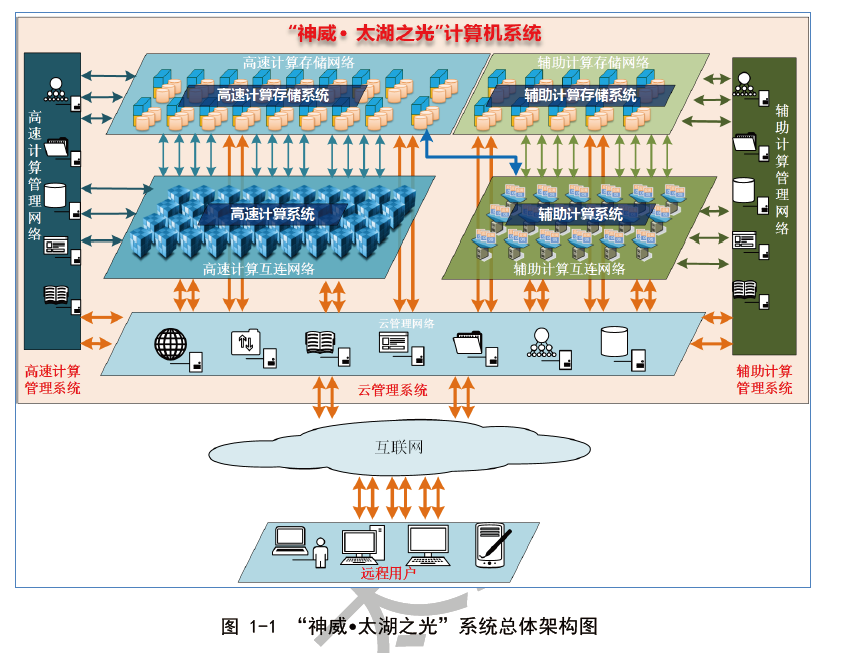

### 集群计算

**概念：**

- 以高速网络（如光缆互联网）连接起来的高性能工作站或微机组成
- 集群系统在运行中像一个统一的整合资源，所有节点使用单一的界面

### 云计算

**概念：**

一种按需供应计算资源的服务模式。用户通过云平台即可获得虚拟机的计算资源，但不知它来自哪里，像云一样无处不在。可算作与电、自来水、通信、燃气并列的基础服务设施。

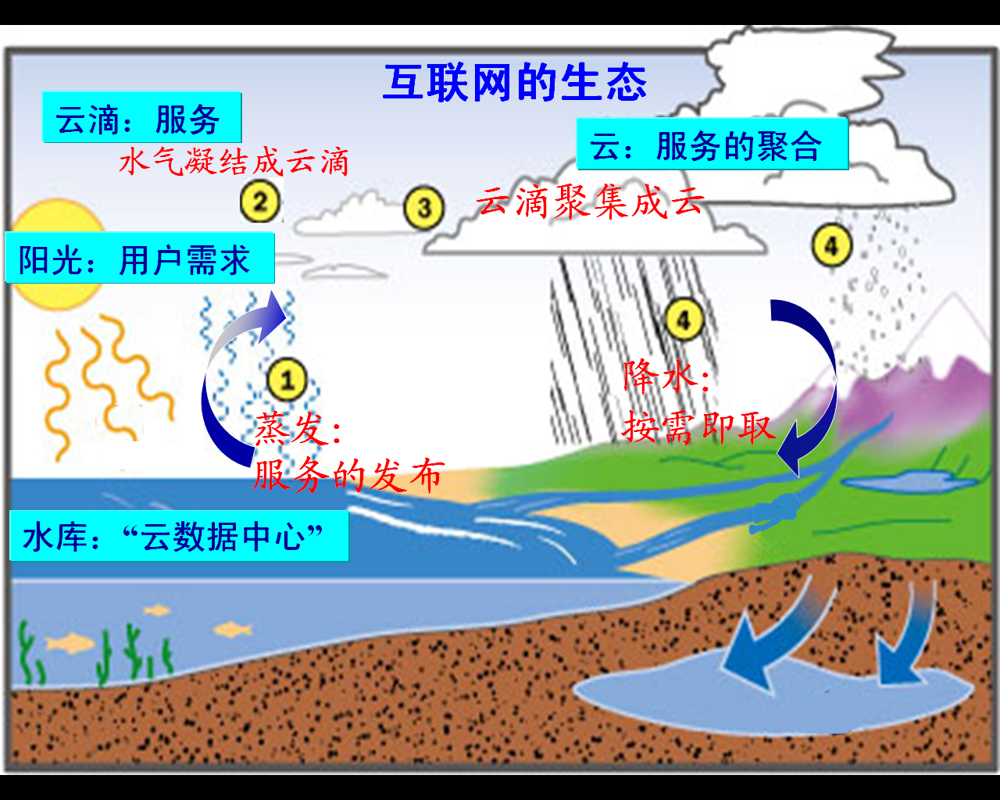

## 计算机概述

计算机和计算

- 期望： 计算机实现数学意义上的“自动计算”
- 现实： 客观世界的形态被“数字化”

### 定义

具备程序能力的数据处理机。它接受输入数据，通过程序处理数据，最后输出数据。

👉*即[图灵机](https://en.wikipedia.org/wiki/Turing_machine)*

### 现代计算机模型

冯诺依曼架构：

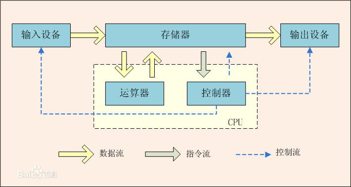

### 计算机系统

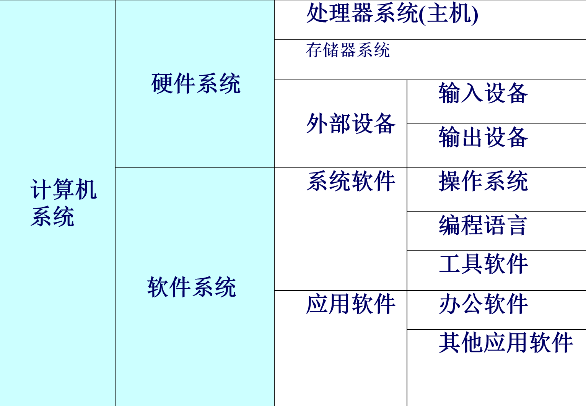

#### 硬件系统

- 硬件：计算机的物理设备，实现计算机操作过程、输入、输出互联的各种电子设备
- 计算机设备：既可以指一个价值过亿的巨型计算机系统，也可以指一个只有数十元的鼠标器

👉第一台现代计算机——1946 ENIAC(Electronic Numerical Integrator And Computer 电子数字积分计算器)

!!! question "计算机是如何运行的"

    通电后：

    - CPU执行启动程序BIOS
    - 操作系统调入内存

    BIOS引导后：

    - 计算机由操作系统管理和控制

## 计算机中数的表示

有些老生常谈的话题就不过多赘述了

### 整数的表示

- 原码
- 反码
- 补码

### 小数的表示

- 定点数： 固定长度，小数点也固定
- 浮点数：类似科学计数法，用阶码表示小数点位置，用尾数表示数的有效数值，如下图所示

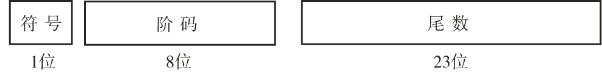

### 编码和文本

用固定位数的二进制序列表示字母、标点等字符

常用编码：

- ASCII码
- Unicode编码
- 汉字编码 —— 在汉字系统中，每个汉字对应两个英文字符宽度

### 多媒体数据

多种数据表示形式，理论上包含文本，但更侧重下面这几种。

#### 图形和图像

图形是轮廓，图像是填充颜色的图形。

**位图技术**

使用像素阵列，每一个像素表示一个点，点数据的大小取决于分辨率。

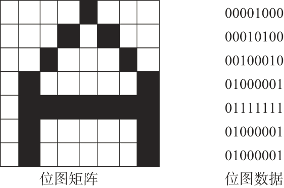

**矢量图技术**

- 存储：将图形分解为曲线和直线的组合，而任何曲线和直线都可以用数学公式表达，把这些公式的组合作为图形数据存储起来
- 显示/打印：将画图公式重新执行，根据给定的大小重现图形图像

🤔相比位图，矢量图看上去更加平滑，不会产生锯齿，但难以表达复杂的细节

#### 音频

音频的应用场景十分广泛，目前没有统一的“数字音频标准”。

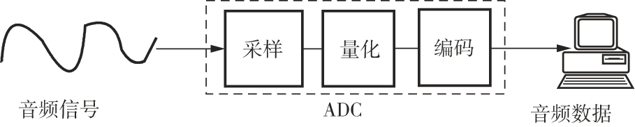

#### 视频

视频是图像的动态过程，经压缩处理后存储，要播放时需要解压。

👉MPEG（动态影像专家小组Moving Picture Experts Group）制定了一系列视频编码和压缩标准，从MPEG-1到MPEG-4

## 计算机系统组成

### 概况

#### 组成

- 处理器
- 存储器
- 输入输出系统
- 系统连接和USB

???+ note "计算机逻辑结构"

    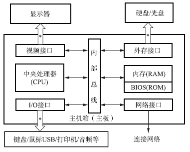

#### 电路

PC机大多数功能电路都安装在主板上

???+ info "PC机的电路"
    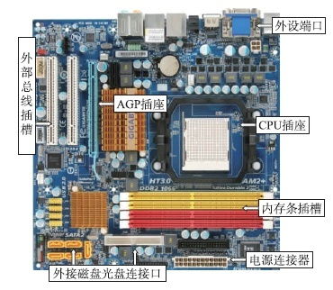

    芯片组：

    - 安装在主板上
    - 管理CPU与外设之间的通信

    分为“南桥”和“北桥” ：

    - “北桥”负责管理、控制机内的总线
    - “南桥”负责外设接口的控制

### 处理器

#### 组成

**功能划分：**

- 运算器
- 控制器
  
👉可以是单一的CPU芯片，也可以是多个CPU芯片组成的阵列。在一个芯片(主板)上也可以集成多个处理器。

???+ info "具体架构"

    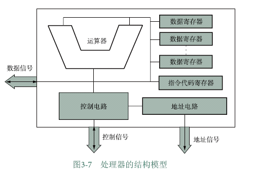

    从逻辑上，可分为5个部分：运算器、控制电路、地址电路、数据寄存器和指令代码寄存器。

    - 取指令
    - 分析指令
    - 执行指令

#### 性能指标

- 主频：衡量CPU运行速度的参数(GHz)
- 集成度：芯片内的晶体管数量——反映了制造技术的先进程度和复杂度
- 字长：一次能处理的最大二进制数的位数（目前主流为32位和64位）
- 协处理器：专门处理某类任务的计算单元（专业vs通用），如浮点数协处理器
- 内部高速缓存器：把CPU频繁使用的数据和指令临时缓存，减少CPU等内存的时间
- 工作温度范围
- 电源电压范围
- 芯片封装材料及结构
  
### 存储器

实现计算机的记忆功能，保存程序代码和数据。

- 存储模式：1个字节就是一个存储单元，每一个字节都有唯一的标识即地址
- 存储容量：存储器中存储单元的总数，或称为地址空间($B \rightarrow KB \to MB \to GB \to TB$ [$\times1024$] )
  
    $2^{address}=capacity$

???+ info "存储系统层次"

    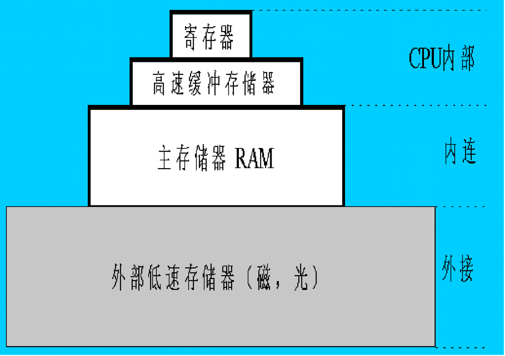

#### 内存

与CPU经内总线连接的存储器，也称主存储器或主存。

在《数字逻辑设计》课程中有更为详尽的介绍

1. 随机存取存储器(RAM)

- 动态RAM(SRAM)
- 静态RAM(DRAM)

👉RAM断电后无法长期保持数据，数据容易丢失

2. 只读存储器(ROM)

- PROM：数据一旦写入，就不能再被改变
- EPROM：可以用一种紫外线光设备将原数据擦除后再写新数据
- EEPROM：可对部分单元进行重新写入

💡ROM断电后数据不丢失，可用来存放BIOS启动程序

#### 外存

一种可以永久存储数据的外设，也称辅助存储器

- 磁介质存储设备：磁带、软盘、硬盘
- 光存储设备：CD、DVD
- 固态存储器(采用半导体材料)：U盘、CF卡（快闪卡）、SM卡（智能卡）

???+ tip "基本工作原理"

    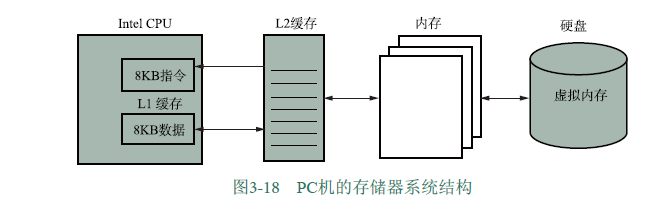

    - CPU执行程序前将磁盘中的数据映射存放到[**虚拟内存**](http://st-anontokyo.github.io/notebook/system/hpc/1/#_42)中，程序需要时再从映射的虚拟内存中取出数据到内存(CPU取指时只能访问内存)
    - 虚拟内存保证了程序之间互不干扰，并且内存不够时OS可以把暂时不用的内存转移至磁盘空间
    - 由OS和CPU共同完成管理和控制存储系统的任务

### 输入输出设备

外设是和用户打交道的，因此又称人机交互设备(HID)

#### 端口

又称接口，是连接输入/输出设备的物理接插件

???+ example "PC机端口种类"
    
    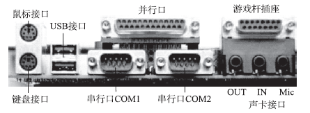

    - 键盘/鼠标接口
    - 并行/串行接口
    - USB接口
    - 音频接口
    - 连接游戏操作杆的插座
    - 显示口

👉端口和主机的数据传输模式有两种，并行（一次传输8位数据）和串行（一次传输一位数据）

#### 输入设备

是人们向计算机系统发出操作命令、输入操作数据的装置。

**键盘**

- 两种端口规格：[PS/2](https://zhuanlan.zhihu.com/p/384221079)和USB
- 键的数目：101键、104键
- 常用键：Shift、Ctrl、Alt、Caps、Lock、Tab、Prt Sc

**鼠标**

鼠标会显示系统的“X-Y位置指示器”，按下鼠标键，它的位置就会被捕捉到计算机中，根据位置信息会对按键动作进行响应

**其它输入设备**

话筒、游戏操纵杆、摄像头、扫描仪等

#### 输出设备

把计算结果的数据或信息以字符、图像、声音等形式表示出来。

**显示器**

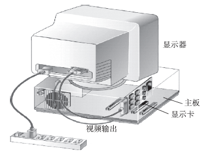

**打印机**

- 激光打印机
- 喷墨打印机
- 针式打印机
- 其它：热升华打印机、热蜡打印机

**其它输出设备**

音响、胶卷等

#### 接口电路

- 声卡：记录和播放声音
- 网卡：接收数据包、拆包；打包、发送数据包

### 内部总线

一组导线，是信号的公共通路，是CPU与存储器及输入/输出控制电路进行数据交换的通路。

- 数据总线：接收或输出数据
- 地址总线：向外输出地址信号
- 控制总线：输出控制信号或接收外部的控制信号

### 外部总线

连接主机与外部设备。

👉USB总线标准

???+ note "接口工作原理示意"

    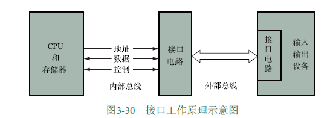

## 操作系统

操作系统是计算机硬件与其它软件之间的接口，能有效地对计算机软件、硬件资源进行管理和使用，使用户能方便地操作计算机

### 类型

看名字就能大概清楚它的适用环境了~

- 实时系统
- 单用户单任务系统
- 单用户多任务系统(MacOS,Windows)
- 多用户多任务系统(Unix)
- 并行系统
- 分布式系统

### 结构

#### 内核(Kernel)

包括操控计算机各种资源的基本模块、设备驱动、内存管理，内核的**调度程序**决定哪一个任务被执行，**控制程序**为这些任务分配时间片。

#### 外壳(shell)

shell接收用户/应用程序的操作命令，将这个命令解释后交给kernel执行。因此外壳也称命令解释器。

shell命令方式：

- 会话式输入
- 命令文件

???+ note "kernel和shell的结构"

    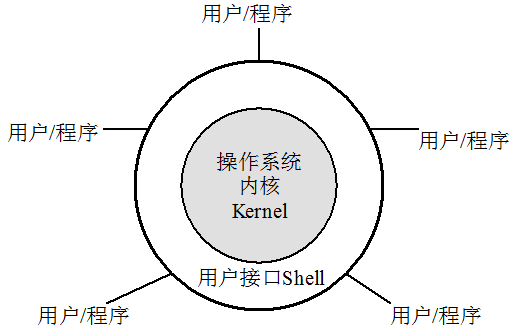

### 功能

#### 进程管理

👉进程：正在执行中的程序

进程管理最重要的任务就是进程调度，其目的在于防止[死锁](https://zh.wikipedia.org/wiki/%E6%AD%BB%E9%94%81)

???+ example "死锁"

    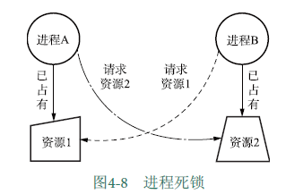

    多个进程同时占有对方需要的资源且同时请求对方占有的资源

👉线程：进程概念的延伸。如果程序只有一个进程就可以处理所有任务，那么它就是单一线程的。如果程序可以被分解为多个进程共同完成程序的任务，那这些进程就叫做"线程"。

#### 存储器管理

存储器管理器(MMU)负责调度内存、监控内存运行状态，还负责管理内存、外存之间的数据交换以及虚拟内存。

**内存管理**

为每个进程合理分配内存。

**内存与外存之间的数据交换**

!!! question ""

    - 何时将程序或数据从外存载入内存？
    - CPU如何在内存中寻找所需要的程序和数据的地址？
    - 如何对内存分区/分块，以存放不同的程序？

    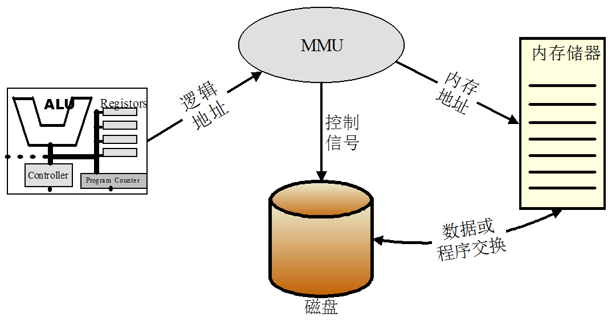

**虚拟存储**

在**磁盘**上开辟一个比内存要大的空间，把被执行的程序装载到这个区域中，按照内存的结构进行组织。

!!! note "这样做的好处"

    - 可在较小的可用内存中执行较大的用户程序
    - 可在内存中容纳更多程序并发执行
    - 不会影响编程时的程序结构
    - 提供给用户的可用虚拟内存通常大于实际物理内存
    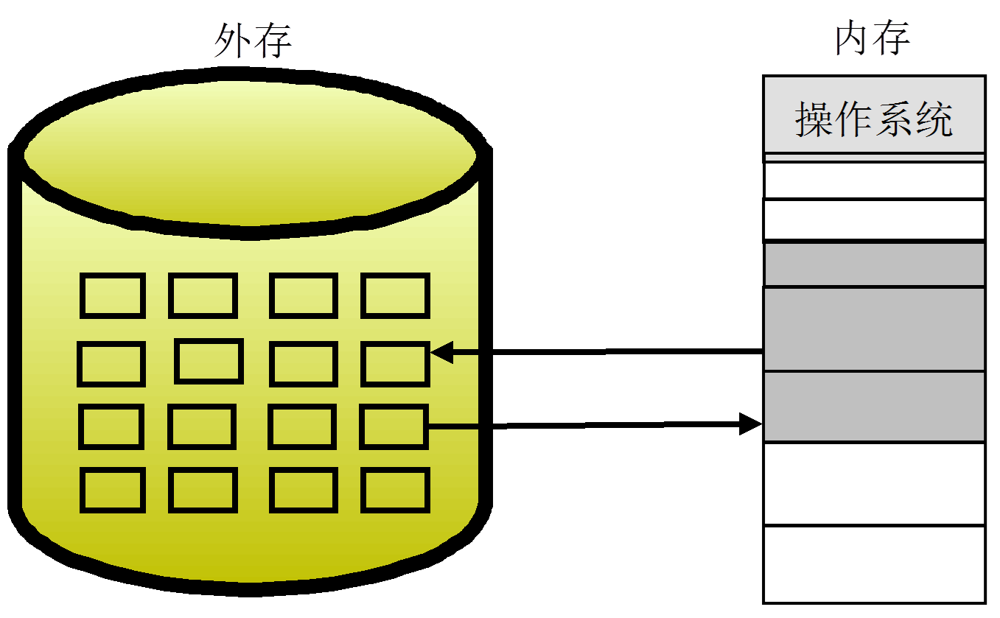

#### 设备管理

对设备进行区分，并制定不同设备的不同访问策略。

**设备类别：**

- 块设备：信息存放在固定长度的块中，每个块都有自己的地址。如磁盘、激光打印机。
- 字符设备：以字符为单位发送或接收字符流。如键盘、鼠标。

**输入/输出(I/O)服务:**

- 设备调度——确定进程按顺序执行I/O请求
- 缓冲区——在两个设备之间/设备和应用程序之间缓存数据
- 错误处理
  
**设备驱动程序：**

控制、操作设备的程序，是一组接口，操作系统通过它来管理设备。

???+ example "例子：启动与停机"

    **启动(按电源开关，通电——)**

    - 执行BIOS
    - 启动装载程序
    - 完成系统引导
    
    **停机(长按电源开关——)**

    - 启动关机过程：数据写入、结束进程、关闭电源
    - （早期计算机关机与操作系统无关）
    
    👉除非将电源插头拔出，否则系统不是断电状态。

#### 文件管理

**文件**

一个存储在存储器上的数据的有序集合，并标记以一个文件名。

**文件系统**

管理文件的系统，可以实现读/写、修改、移动等各种文件操作。

- 统一管理外存空间，以便合理地组织和存放文件
- 建立用户能看见（显示/打印）的文件的逻辑结构
- 支持对存储设备上的文件进行检索、查找和提供文件的访问控制

**文件命名**

用字母、数字和某些字符的组合来唯一标识文件

???+ example "不同操作系统的文件命名规则也不同"

    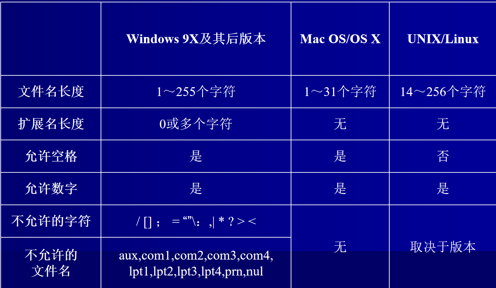

    👉Windows操作系统中，文件格式一般为[盘符:]文件名[扩展名]，如“C:text.txt”

    （盘符中，A、B为软盘，C~Z为硬盘或光盘）

**文件存取**

1. 顺序存取：一个接一个信息单位存取，最典型的是磁带文件的存取。
2. 随机存取：以文件名为单位进行存取，主要方式有索引、哈希以及二分法等。

---

- 索引：索引文件是为了检索需要建立的文件，存储关键字（用户输入的）和地址（目标文件的存取地址）
- 哈希：通过函数将用户给出的关键字映射到目标地址
- 二分法：二分查找

**文件的存储结构**

- 存储单元：簇(cluster)或区块

👉簇：几个相邻的磁道和扇区组成的扇区组

- 存储器的物理区块：划分的越小，存储器的使用率就越高；划分得越细，管理这种划分的开销就越大

❗如果一个存储单元被文件存放了数据，哪怕只存放了一位，它也会被标记为全部被这个文件使用

## 计算机网络

### TCP/IP

传输控制协议/网络互联协议 (Transmission Control Protocol / Internet Protool)

???+ note "TCP/IP工作示意"

    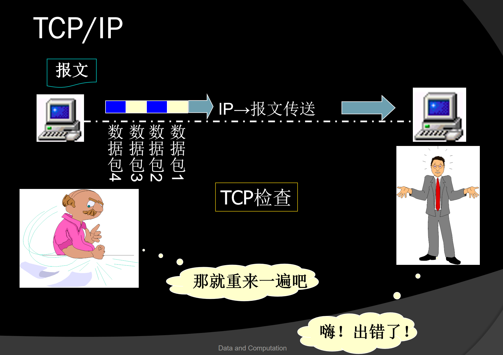

    - TCP：负责数据打包、编号，并在接收端将数据按原格式组合
    - IP：为每个数据包加上接收机地址后在网络信道中传输

??? info "开放系统互联参考模型(OSI)与互联网技术"

    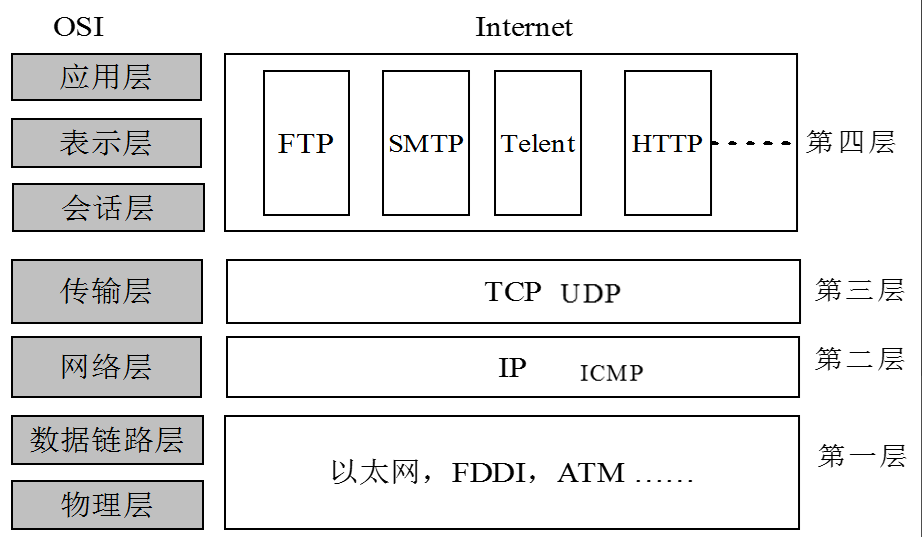

### IP地址

IP协议规定，每台入网的计算机都必须有一个唯一的网络地址，即IP地址。拥有IP地址的机器叫主机，路由器根据IP地址传输数据包。

👉IP地址是临时的，如果计算机断网后重连，它被分配的IP地址可能不同。可以说IP地址代表计算机的“当前位置”，但不能当作身份证明。

???+ example "IP地址的格式"

    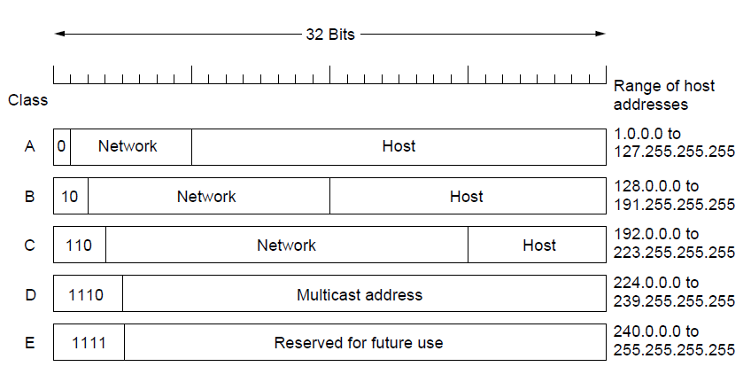
    
    👉一般的IP地址都是形如“网络类别+网络号+主机号”的

    专用地址/私有地址：只能用作一个机构的内部通信，不能进入因特网，路由器对专用地址一律不转发。

    专用地址范围：

    - 10.0.0.0 ~ 10.255.255.255
    - 172.16.0.0 ~ 172.31.255.255
    - 192.168.0.0 ~ 192.168.255.255

#### 子网和子网掩码

**子网**

把一个较大的网络分为若干较小的网络，并通过路由器连接起来，这些具有相同网络标识的小网络就称为子网(subnet)。

**子网掩码**

划分子网后要告诉网络子网是如何划分的，这就是子网掩码。将IP地址原来的“网络-主机”结构调整为“网络-子网-主机”的结构。

💡划分子网可以在不同子网段采用不同的逻辑结构，优化网络组合；同时通过**重定向路由**，减轻网络拥挤，提高网络速度。

👉重定向路由：在当前子网里找到最合适的路由器，来实现“下一跳”。

???+ tip "子网掩码"

    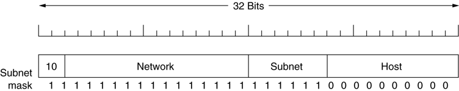

    将子网掩码与通信方的IP地址进行**逻辑与**操作，通过1保留网络地址，通过0抹去主机号，最后得到的就是其网络地址。可以通过这种方式判断两台通信主机著否位于统一子网。

    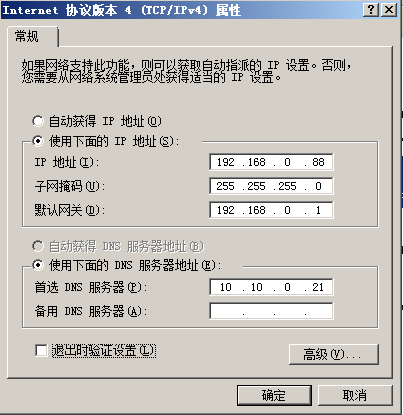

   

# 评论区

