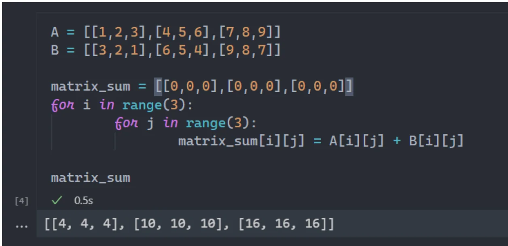
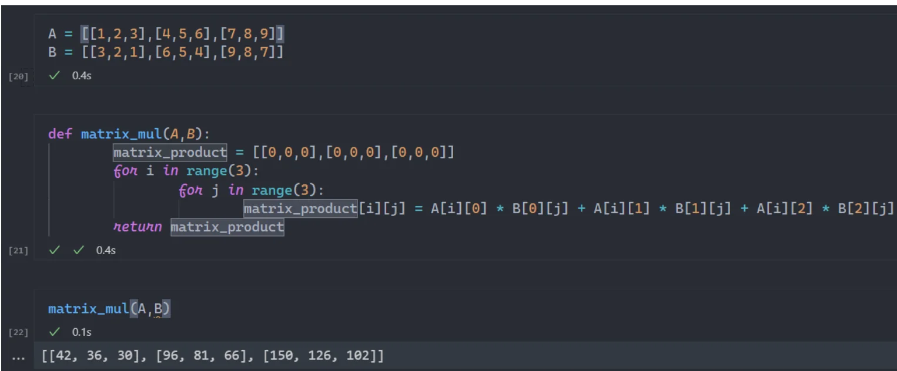
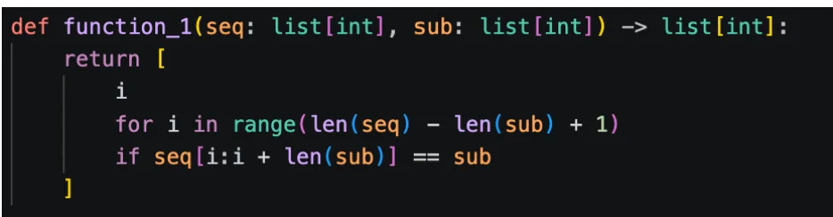
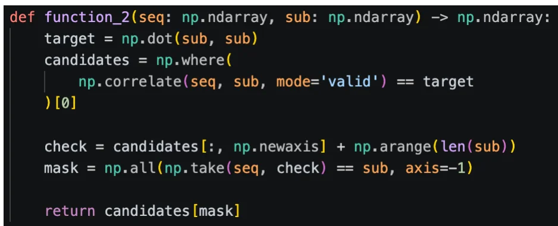
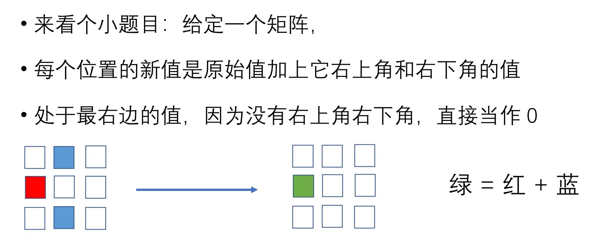
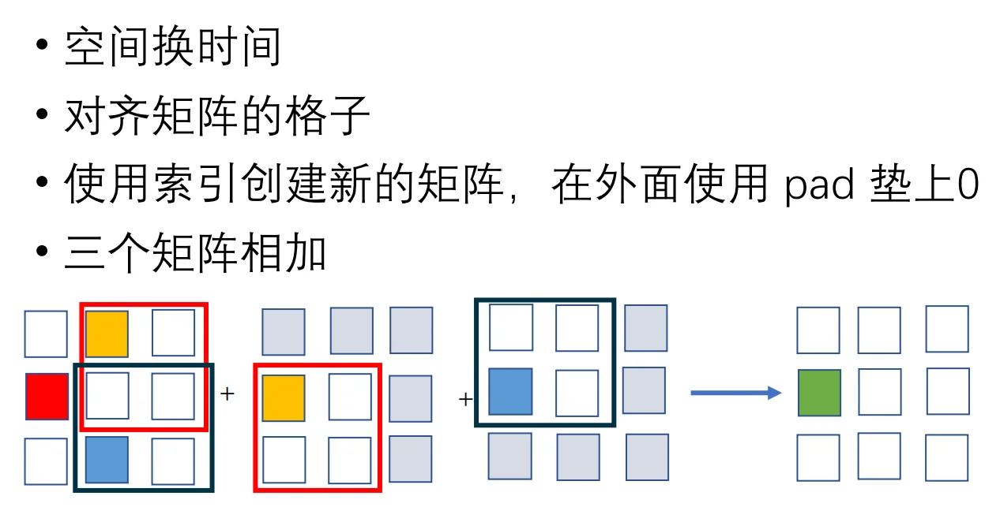
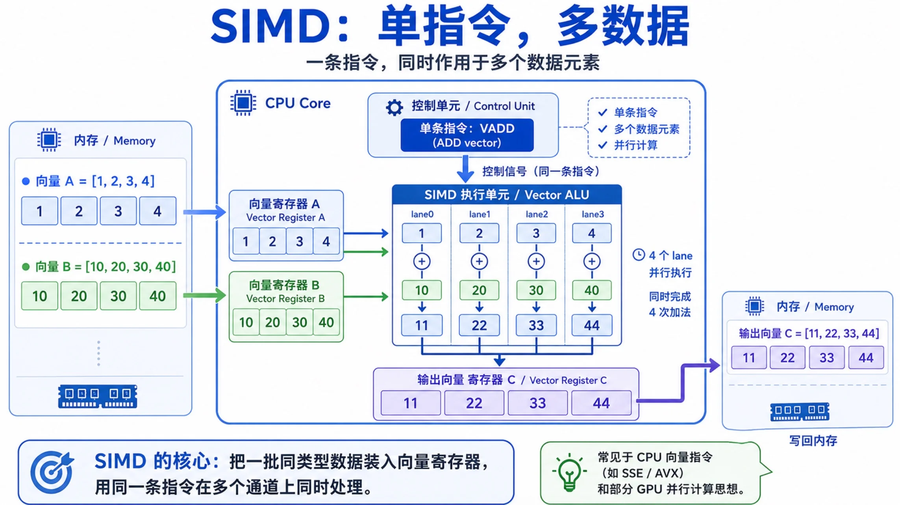

# 向量化并行计算基础

💡向量化计算就是把一批数据当作一个整体同时运算，而不是一个一个依次处理。

**概念引入**

- 标量(scalar)： 单个数据值。如：一个整数、一个浮点数。
- 向量(vector)：一组同类型的数据，如：一串整数、一串浮点数。

???+ note "两种处理方式"

    **标量计算：**
    
    - a = 3
    - b = 10
    - a + b = 13
    
    👉一次计算只处理一个元素。（串行）

    **向量计算：** 
    
    - A = [1, 2, 3, 4]
    - B = [10, 20, 30, 40]
    - A + B = [11, 22, 33, 44]

    👉这里是把整组数据交给向量处理单元，让它们**同时**处理多个元素。（并行）

## 向量化

**核心思想：**一次同时参与运算的不是一个值，而是多个值一起算，即一个向量。通过将一些串行的程序向量化，我们可以优化它的性能。

???+ example "矩阵加法"

    

    👉大量使用for循环，一次只能执行一条，造成极大浪费。

    💡**优化思路：**矩阵相加的过程中，一个位置的运算和其它位置都没有关系（无依赖关系），只和原来两个矩阵相应的坐标值有关。所以矩阵加法可以并行完成。

???+ example "矩阵乘法"

    

    👉实际有三重for循环，因为行列数已知所以最里面的for被展开了。

    💡**优化思路：**从 $A \times B = C$ 入手，C矩阵中的每一个值$C_{i,j}$都是由A矩阵和B矩阵的两个一维的向量相乘得到的(行向量A_i和列向量B_j)，在计算时是不相干的，并且读取过程中输入不会被改动，因此可以并行处理。

## NumPy

使用python进行科学计算的基础包，一个用来做矩阵运算的库。它提供了数组、矩阵和批量运算接口。我们需要找到那些可以看作向量的部分，把数据转变成能使用向量化接口的样子，从而使用NumPy。

**两个例子：**

???+ example "查找子序列"

    👉下面这段代码在序列seq中查找所有子序列sub对应的起始位置：
    

    👉这是用NumPy优化后的代码：

    

    - **点积：**计算sub子序列与自己的点积，存放到target中。
    - **用点积初筛：**使用np.correlate函数，以sub为窗口长度在seq序列上逐个单位滑动，计算每个窗口与sub的点积（理论上是同时计算的），比较与target是否相同，np.where自动取出值为True的下标，将结果存入candidates。
    - **得到完整索引：**通过candidates[:, np.newaxis]把candidates从一位数组转置为列向量，而后使用np.arange(len(sub))得到子序列所有下标（每一行代表一个候选序列），索引矩阵存入check。
    - **与sub逐位比较：**使用np.take取出每行索引对应的子序列，将其与sub对比，axis=-1表示逐行检查。通过np.all将每行对比所得的布尔值and起来，最后将整行的判断结果存入mask。mask是一个布尔数组
    - **返回结果：**执行candidates[mask]后，NumPy会按照mask中的结果（True/False）依次判断candidates中的起始位置是否正确，返回正确的起始索引数组。

???+ example "隐式的矩阵加法"

    

    👉可以转换成三个矩阵相加，从而实现并行。

    

## SIMD 向量化

单指令多数据流（Single Instruction Multiple Data）——CPU发出一条指令，同时处理多个数据。

???+ info "SIMD"

    

    👉在x86架构下，SIMD一般和AVX等指令集联系在一起——AVX指令集中提供了大量可以单指令操作多个数据单元的指令。

???+ example "实践1"

    待施工······