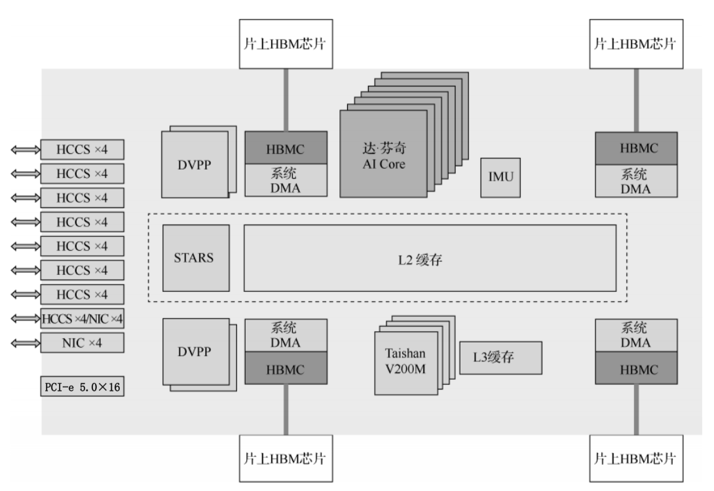
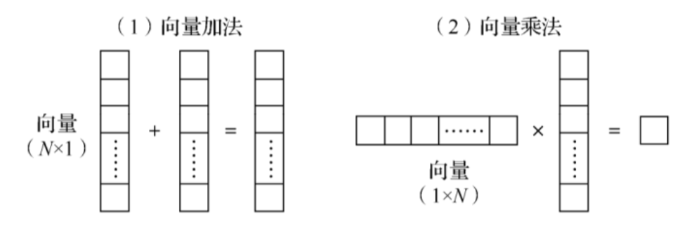
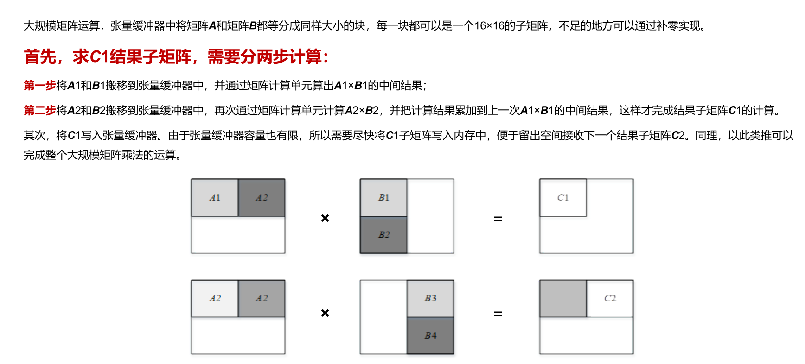
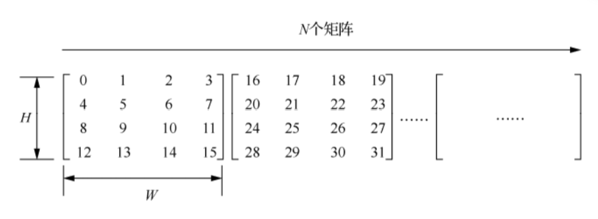
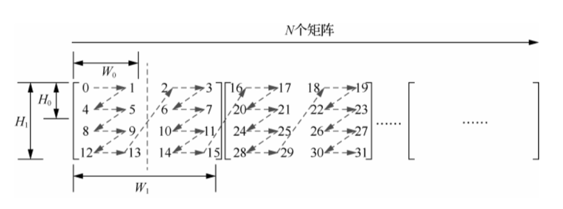
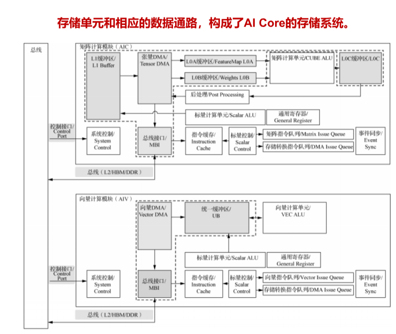
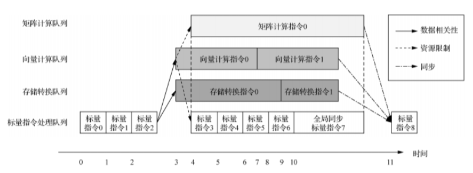
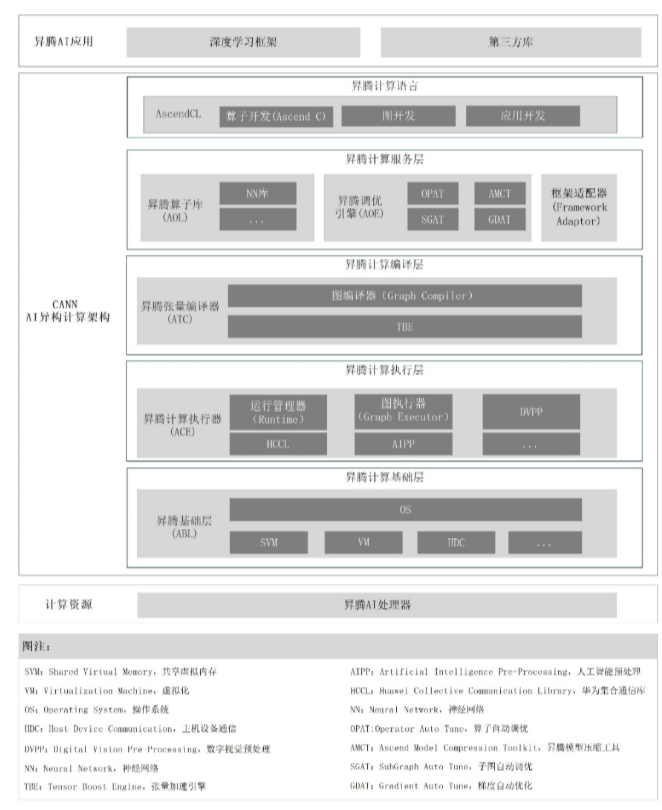
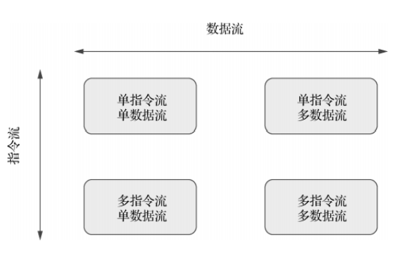
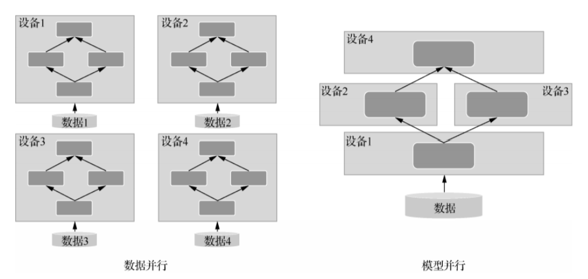

# 华为昇腾异构并行程序设计

## 昇腾AI处理器软硬件架构

### 昇腾(Ascend)AI处理器

???+ note "处理器芯片的逻辑架构"

    

    - 芯片系统控制处理器（Control CPU）
    - 面向计算密集型任务的AI计算核心（AI core）
    - 面向非矩阵计算任务的AI处理器（AI CPU）
    - 层次化的片上系统缓存/缓冲区
    - 数字视频预处理模块（Digital Video Pre-Processing， DVPP）
    - I/O接口

👉与能够处理各种任务的通用CPU不同，AI处理器芯片集成了若干AI core，专门负责执行矩阵、向量计算密集的算子任务。

### 达·芬奇架构

华为自研的AI core，主要由三部分构成：

- 计算单元：包含三种基础计算资源（标量、向量、矩阵计算单元）。
- 存储系统：AI core的片上存储单元与相应的数据通路构成了存储系统。
- 控制单元：在整个计算过程中提供指令控制。

#### 计算单元

**标量计算单元**

负责完成标量相关的运算，相当于一个微型的CPU，控制整个AI core的运行。

功能：

- 对程序中的循环进行控制、实现分支判断，判断结果可以用来控制其它单元的流水线。
- 为矩阵/向量计算单元提供数据地址和相关参数的计算，也可以执行基本的算数运算。

👉它的周围配备了多个**通用寄存器**（用于寄存变量/地址，为算术逻辑计算提供源操作数和中间计算结果）和**专用寄存器**（用来支持指令集中一些指令的特殊功能，一般不可以直接访问）。

**向量计算单元**

负责完成向量相关的计算。

**矩阵计算单元**

负责完成矩阵相关的计算。

???+ example "矩阵乘法"

    

    💡分块后就可以并行计算多个块矩阵的乘法，最后统一结果即可。

#### 存储系统

???+ tip "数据存储格式"

    **ND格式：**每个张量（在这里相当于分分块矩阵）中的数据按从左到右、从上到下顺序存储在内存中。

    

    **NZ格式：**每个张量中的数据按照“Z字型”遍历存储。

    

存储系统由存储单元和相应数据通路构成。

**存储单元**

存储单元由存储控制单元、缓冲区、寄存器和数据搬运单元构成。

- 存储控制单元：可直接访问缓存和内存，内部设置了存储转换单元，作为数据通路的传输控制器，负责AI core内部数据在不同缓冲区之间的读写管理，以及完成一系列格式转换操作（补零、转置、解压缩等）。
- 输入缓冲区：用来暂时保留需要频繁重复使用的数据。
- 输出缓冲区：用来存放神经网络每层计算的中间结果，方便下一层获取数据。
- 寄存器：主要是标量计算单元在使用。
- 数据搬运单元：负责板上数据搬运以及与主线进行数据交换。

#### 控制单元

由系统控制模块、指令缓存模块、标量控制模块、指令队列模块和事件同步模块组成。

- 系统控制模块：控制任务块的执行进程。任务执行完毕会进行中断处理和状态申报，执行过程出错会把错误状态报告给调度器。
- 指令缓存模块：在指令执行过程中，预取后续指令，并一次读入多条指令到内存，提升指令执行效率。
- 标量控制模块：将指令解码并统一导入标量队列，实现地址解码和与运算控制；读取标量指令队列中配置好的指令地址和参数解码，并根据指令类型分发到对应的指令执行队列中（标量指令不动）。
- 指令队列模块：由矩阵/向量/标量/存储转换（管理不同存储层级间的数据搬运）指令队列构成。不同指令进入相应计算队列顺序执行。
- 事件同步模块：时刻控制每条指令流水线的执行状态，并分析不同流水线间的依赖关系。

### CANN系统架构

专门为高性能深度神经网络计算需求所设计和优化的一套架构。对上承接各种AI框架，对下服务AI芯片与编程。

???+ abstract "CANN系统架构"

    

    - 昇腾计算语言：提供了一套API，用来管理和使用昇腾软硬件的计算资源。有算子开发语言Ascend C，图开发和应用开发的API接口。
    - 昇腾计算服务层：提供了算子和模型的开发调优工具、AI算子库、AI框架适配、系统管理工具等应用层能力。
    - 昇腾计算编译层：编译高级算子，转换成AI core能执行的指令。
    - 昇腾计算执行层：执行各种指令。
    - 昇腾计算基础层：为各层提供基础服务。如操作系统、共享虚拟内存、设备虚拟化、主机-设备通信等。

## Ascend C快速入门

### 并行计算的基本原理

第一讲提过，这里补充一下分类。

#### 分类

!!! note "从计算机硬件、系统以及应用三个层面分类"

    - 指令级并行：处理器内部多个指令能够在同一个时钟周期执行。这种并行不需要手写，由处理器硬件管理。例：超标量架构——允许每个时钟周期发射多条指令到不同的执行单元；流水线——将指令分解为小步骤，每个步骤由不同的处理器部件顺序完成，但一个指令的某一阶段可以与其它指令的某一阶段重叠（没有依赖关系的话）。
    - 线程级并行：创建多个线程，并行地运行在不同的处理器及核心上。
    - 请求级并行：当多个独立的客户端发送请求到服务器时，服务器会创建不同的处理流程来同时处理。

!!! note "从软件设计和编程模型的角度分类"

    - 数据级并行：将较大数据分割为较小的块，然后在多个处理单元上并行处理这些数据块。如上面提到的矩阵分块乘法。
    - 任务级并行：将工作分解成独立的任务，这些任务可以在不同的处理单元上执行。

??? abstract "费林分类法"

    

#### 大模型并行加速的基本原理

- 数据并行：将大规模的数据集划分为多个批次，分配给不同计算节点处理。
- 模型并行：将模型的不同部分（如不同的层/网络）分布到不同的计算节点上。（各个节点负责一部分计算，可能需要频繁的跨节点通信）

### Ascend C 开发