# Introduction to Profiling

---

!!! question "为何会有如此大的性能提升？"

    

## What is Performance?

### 如何衡量

**Two different questions:**

- How long does one operation take, start to finish? ⇒ Latency (s)
- How many operations complete per unit time? ⇒ Throughput (op/s)

| |Latency |Throughput |
|-|:-------:|:---------:|
|Question|“how long until my result?” |“how many results per second”|
|Units|s, ms, ns, cycles|op/s, FLOP/s, B/s, req/s|
|Set by|the **dependent chain**|the **parallel width**|
|In hardware|memory access time, network RTT|memory / link bandwidth|

???+ abstract "Little's Law"

    - One-at-a-time: throughput = 1/latency
    - Little's Law: &emsp;$inflight = throughput \times latency$

    

### 流水线


The out-of-order engine you just saw is a pipeline: while one FMA（浮点数乘加指令） executes,
the loads for the next iterations are already in flight.

👉计算与读内存并行

👉**the dependent chain is what nothing can hide**——指令间的依赖关系不能被流水线隐藏，需按照先后顺序

$Runtime = \max(dependent chain,throughput limits)$

???+ example "One Accumulator vs. Eight"

    

    - 单链每次s自增都依赖上一个结果，CPU必须一个一个顺序执行。
    - 八链将单次迭代拆分成8个独立累加，最后再对s0~s7求和，减少了依赖关系，使得CPU可以并行处理。

    

    👉The FMA unit is a pipeline: latency 4 cy, but it can start a new op every cycle — if that op is independent.

### 内存性能衡量

!!! tip "Memory by the Numbers"

    &emsp;&emsp;&emsp;&ensp;**latency side**

    

    ---

    &emsp;&emsp;&emsp;&ensp;**bandwidth side**

    

### 程序性能瓶颈

#### Roofline Model


👉横轴I表示每字节内存访问能完成的浮点运算次数，反映了程序的密集程度；纵轴表示每秒完成的浮点运算次数，反映程序性能。

**Can be optimized：**

- A: memory-bound, need to saturate β.（β为内存带宽，其代表系统每秒能传输的数据量，限制了程序性能）
- B: compute-bound $\pi$, use vectorize, FMA.（$\pi$为处理器的理论最大计算能力）
- C: latency-bound, not enough concurrency.（延迟问题）

#### Amdahl’s Law

Let p be the parallelizable fraction, on N cores. S represents "speed up"（加速比）:

<br>

&emsp;&emsp;&emsp; $S(N) = \frac{1}{(1-p)+\frac{p}{N}}$ &emsp;&emsp;&emsp; $S(\infty)=\frac{1}{1-p}$

<br>

💡尽可能增大p的值，找到尽可能多的可并行的地方。

### Two Design Philosophies: CPU vs. GPU

**CPU：minimize latency**

- few powerful cores, huge caches
- out-of-order, branch prediction
- one thread finishes fast


**GPU：maximize throughput**

- thousands of simple lanes
- latency hidden by other warps
- any single thread is not that fast


???+ example "Experiment 1: Serial Chain"

    ```C
    for (long i = 0; i < n; i++)
    { x ^= x << 13; x ^= x >> 7; x ^= x << 17; }
    ```

        CPU, 1 core (m701): 2.15 ns/step
        GPU, 1 thread (H800): 17.38 ns/step <- 8x slower

    - need enough parallelism for GPU to win.

???+ example "Experiment 2: Throughput"

    Dense 16-bit GEMM（General Matrix Multiplication）, N = 8192:

        48 CPU cores, MKL bf16 (AMX tiles): 25.4 TFLOPS
        one H800, cuBLAS fp16 (tensor cores): 683 TFLOPS <- 27x

    - every tile of C is independent work: 81922 outputs → millions of parallel tasks → GPU wins 

**CPU must**
- the OS, syscalls, drivers
- branchy control flow
- pointer chasing (trees, parsers)
- latency-critical serial logic
- launching the GPU’s work

**GPU shines**
- GEMM
- stencils, images, rendering
- attention / convolutions
- Monte Carlo, particles
- anything = millions of independent tasks

👉Neither replaces the other — serial work still needs a CPU; throughput
belongs to the lanes.

## Measuring the Machine

### Ceilings

👉**Know Your Ceilings First：**

A performance number is meaningless until you compare it against the
ceiling, so measure the roofs (π Compute Capability, β Memory Bandwidth) first. The roof also tells you when to stop.

???+ question "如何测量？"

    

## Profiling the Program


### 案例分析：矩阵乘法（GEMM）

#### Round 0: Naive GEMM

``` C linenums="1"
for (long i = 0; i < n; i++)
    for (long j = 0; j < n; j++)
        for (long k = 0; k < n; k++)
            C[i * n + j] += A[i * n + k] * B[k * n + j];
```

    N=1024 time=4.046 s perf=0.53 GFLOP/s

😅One core’s roof is 82, we are at 0.6%.

???+ question "What Does the Machine Actually See?"

    

    由于矩阵按行主序存储（同一行数据从左到右连续存在内存里），在内层循环中列遍历矩阵B时，列邻居在内存中相隔甚远，内存地址跳变大。

    - One iteration = 1 FMA + 1 friendly load + 1 hostile load

    👉在缓存中表现就是这样：

    

- Classify by what the innermost loop streams:

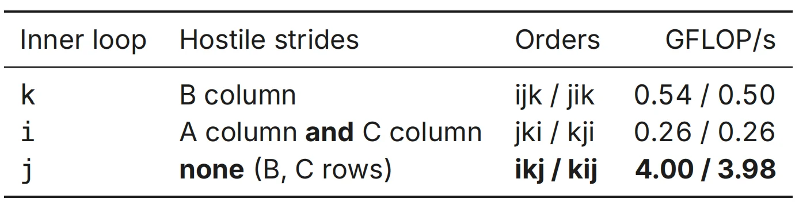

💡我们发现，调整顺序，把j放到内存循环后，就不再需要列遍历，只有行遍历了。

#### Round 1: Fix the Access Pattern (ikj)

```C linenums="1"
for (long i = 0; i < n; i++)
    for (long k = 0; k < n; k++) {
        double a = A[i * n + k];
        for (long j = 0; j < n; j++)
            C[i * n + j] += a * B[k * n + j];
}
```

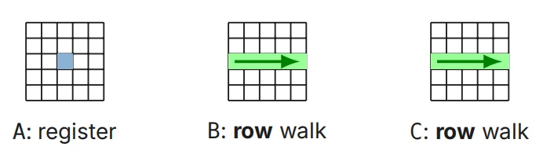

    N=1024 time=0.54 s pref=4.0 GFLOP/s

???+ quote "使用VTune工具进行性能分析"

    VTune是Intel开发的性能分析工具，它通过收集如下所述的多维度的数据帮助开发者识别性能瓶颈。

    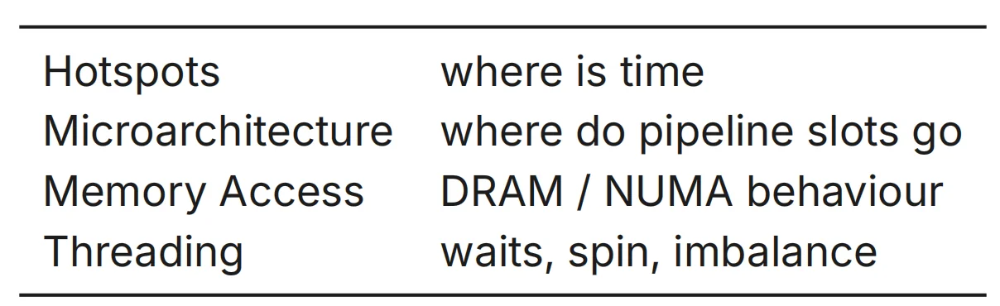

    - Top-down accounting: every slot is **Retiring** / **Front-end** / **Bad speculation** / **Back-end** （将程序执行中的每个流水线槽位，按执行状态分类为四类）

**VTune Microarchitecture View on GEMM**

```bash title="bash"

vtune -collect uarch-exploration -- ./gemm_naive 1024

```

**R0与R1性能对比：**

| |naive (ijk)|ikj (-O3)|
|-|:---------:|:-------:|
|CPI Rate（每指令周期数）| 1.58| 0.88|
|Retiring（退休指令占比）| 9.2%| 21.7% of pipeline slots|
|Back-End Bound（后端瓶颈）|90.6% |73.6%|
|Memory Bound（内存瓶颈）| 63.9% |34.0%|

👍The quantified verdict: memory-bound, and R1 halves it.

???+ failure "Zoom Out: What One Outer i Really Touches"

    - GEMM: $2N^3$ FLOPs on $3N^2$ data — every element could be used $N$ times.

    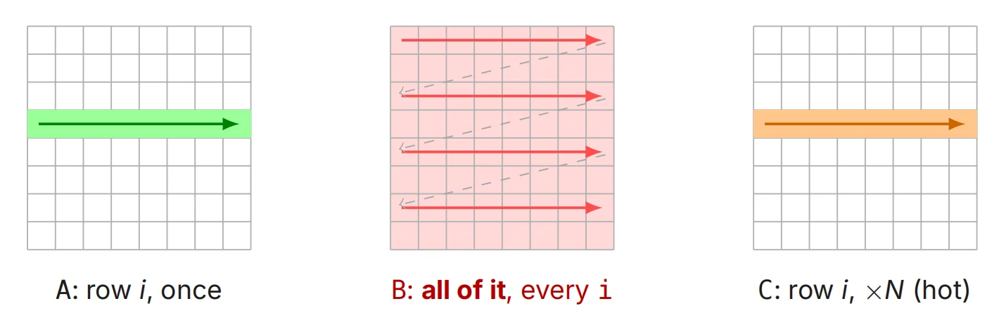

    👎Nothing of B survives — the cache holds it, but never gets to reuse it——每次i循环都要重复遍历B中所有元素(j,k的所有组合)

💡Decision by Arithmetic: Size the Blocks.

#### Round 2: Blocking

```C
for (long ii = 0; ii < n; ii += BS) // tiles sized so that
    for (long kk = 0; kk < n; kk += BS) // A, B, C blocks stay
        for (long jj = 0; jj < n; jj += BS) // resident in cache
            /* ikj loops within the tile */
```

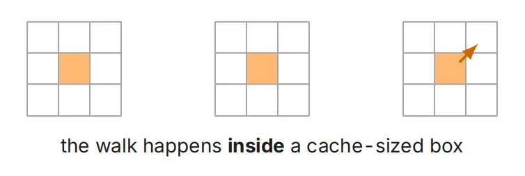

- Blocking changes traffic, not instructions

👉通过计算让$BS \times BS$的小矩阵的大小适配缓存，避免超出缓存后丢失较早的数据，于是整个内部的ikj循环就可以不断复用缓存。

???+ success "Zoom Out Again: the Same Sweep, in Block Units"

    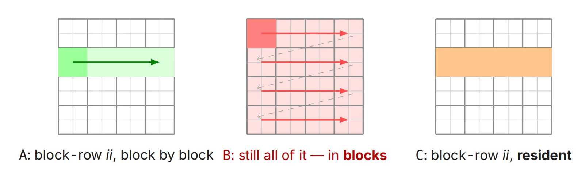

    - Same sweep, new unit: the block is consumed while it is still in the cache.

    👉**Residency: What Actually Lives in the Cache——**

    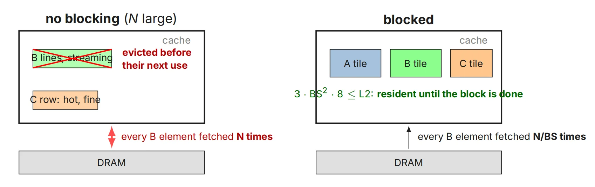

    - B traffic drops BS×: a line now serves a whole block of work before it leaves — (the library’s packed panels push this to “each matrix ∼once”).

#### Round 3: Auto-Vectorization 

&emsp;&emsp;&emsp;&emsp;&emsp;&emsp;&emsp;&emsp;&emsp;&emsp;&emsp;&emsp;&emsp;&emsp;**— Sometimes Free Performance**

```C title="编译命令：让编译器自动将程序向量化"
gcc -O3 -march=native -fopt-info-vec-missed gemm_ikj.c # what & why not
```

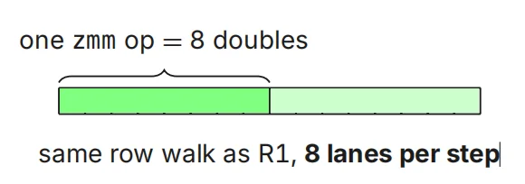

    ikj -O2: 4.0 GFLOP/s ikj -O3 -march=native: 7.2 GFLOP/s (1.8x)

- The vectorizer gives up silently. 编译器在尝试自动向量化的过程中遇到了阻碍，于是它放弃了。

???+ note "when auto-vec?"

    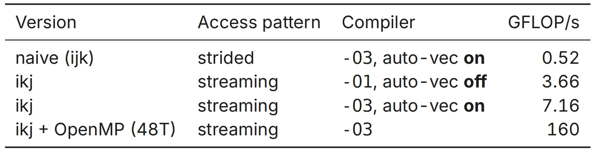

    👉优先级应该是：layout（内存布局） → parallel（并行化） → auto-vec（自动向量化） → intrinsics last（手写SIMD内联互编）

???+ question "为什么自动向量化只能达到7.16？（当手工能达到160）"

    每次内层的ikj循环中，都进行了四个操作：load B + load C + FMA + store C

    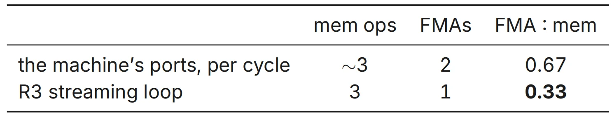

    😭即使数据已经被放在了极度靠近 CPU 的 L1 缓存里，CPU 的数据端口（CPU与缓存间运输数据的通道）数量也是有限的。即便增大向量的宽度，CPU也只能等待数据传输过来，不能立即进行FMA运算。

    🤔我们可以在寄存器内部存储C的一个分块。寄存器在CPU内部，不依赖数据端口传输数据。如此，C矩阵的数据就可以反复消耗不同位置的A和B的数据，消除了load C/store C的步骤，还腾出了端口。这样每取一次内存，就可以进行大量FMA运算。

#### Round 4: the Micro-Kernel AVX-512

```C linenums="1" title="代码"
__m512d c00 = _mm512_setzero_pd(), c01 = ..., c10 = ..., c11 = ...; ; /* 4x2 zmm accumulators */
for (long k = 0; k < n; k++) {
    __m512d b0 = _mm512_load_pd(bp + k*16);
     /* packed B panel, load first 8 elements into register b0*/
    __m512d b1 = _mm512_load_pd(bp + k*16 + 8);
    /*load the other 8 elements*/
    c00 = _mm512_fmadd_pd(_mm512_set1_pd(A[i*n+k]), b0, c00); 
    /* copy A into 8 register-channel multiply B's 8 elements at the same time ... */
}
```

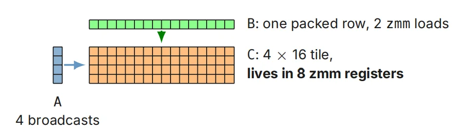

    N=1024: 53.3 N=2048: 55.2 GFLOP/s = 2/3 of the one-core roof (82)

#### Round 5: Going Multicore — OpenMP on the Micro-Kernel

使用openMP，在R4的基础上把矩阵A、C按行分给多个线程（C[i][j]的计算不依赖C中其它元素，可以并行），各个线程共享缓存L3中B的数据。

```C linenums="1" title="代码"
#pragma omp parallel /* each thread: one contiguous row band */
{ long i0 = (n/4 * t / T) * 4;
long i1 = (n/4 * (t + 1) / T) * 4;
/* R4 kernel body unchanged; packed B shared by all */ }
```

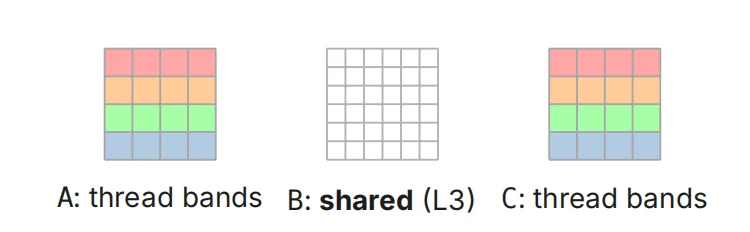

    N=2048: 1T 54 12T 592 24T 969 48T 1729 96T 707 GFLOP/s
    N=4096: 48T 1531 N=8192: 48T 1432 (gemm_avx512_omp.c)

- 32× @48T = 56% of π; 96T regresses——线程数增加到96后性能严重倒退。

???+ bug "Threading Reality Check: Spin Time（自旋时间）"

    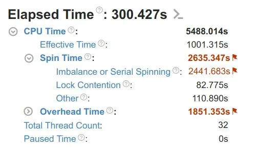

    - Wall-clock says “parallel”; the profiler says half idle.
    
    👎Some Real HPC app, 32 threads: of 5488s CPU time, 2635 s is spin. 

    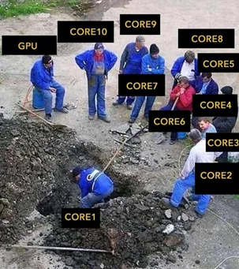

