# Introduction to Profiling

---

!!! question "为何会有如此大的性能提升？"

    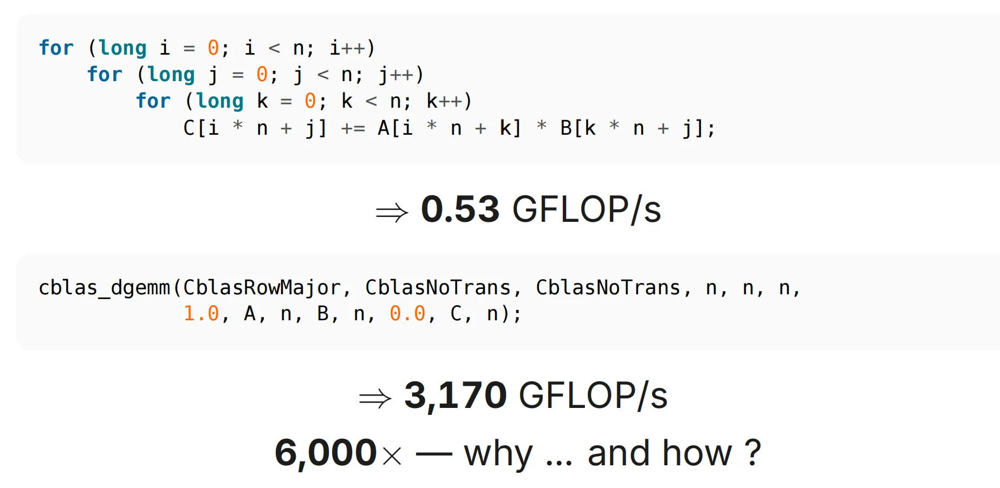

## What is Performance?

### 如何衡量

**Two different questions:**

- How long does one operation take, start to finish? ⇒ Latency (s)
- How many operations complete per unit time? ⇒ Throughput (op/s)

| |Latency |Throughput |
|-|:-------:|:---------:|
|Question|“how long until my result?” |“how many results per second”|
|Units|s, ms, ns, cycles|op/s, FLOP/s, B/s, req/s|
|Set by|the **dependent chain**|the **parallel width**|
|In hardware|memory access time, network RTT|memory / link bandwidth|

???+ abstract "Little's Law"

    - One-at-a-time: throughput = 1/latency
    - Little's Law: &emsp;$inflight = throughput \times latency$

    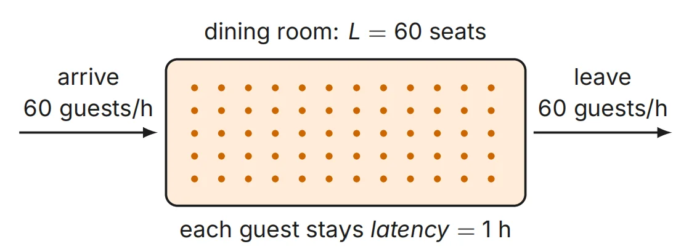

### 流水线

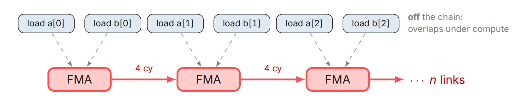

The out-of-order engine you just saw is a pipeline: while one FMA（浮点数乘加指令） executes,
the loads for the next iterations are already in flight.

👉计算与读内存并行

👉**the dependent chain is what nothing can hide**——指令间的依赖关系不能被流水线隐藏，需按照先后顺序

$Runtime = \max(dependent chain,throughput limits)$

???+ example "One Accumulator vs. Eight"

    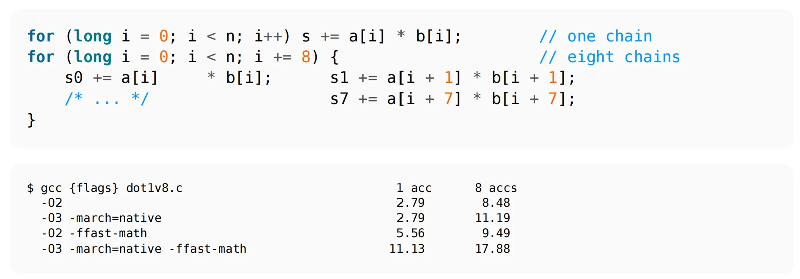

    - 单链每次s自增都依赖上一个结果，CPU必须一个一个顺序执行。
    - 八链将单次迭代拆分成8个独立累加，最后再对s0~s7求和，减少了依赖关系，使得CPU可以并行处理。

    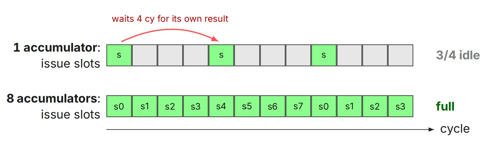

    👉The FMA unit is a pipeline: latency 4 cy, but it can start a new op every cycle — if that op is independent.

### 内存性能衡量

!!! tip "Memory by the Numbers"

    &emsp;&emsp;&emsp;&ensp;**latency side**

    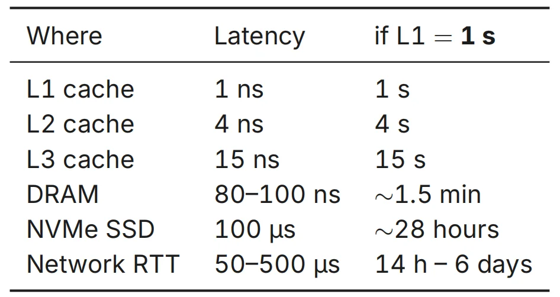

    ---

    &emsp;&emsp;&emsp;&ensp;**bandwidth side**

    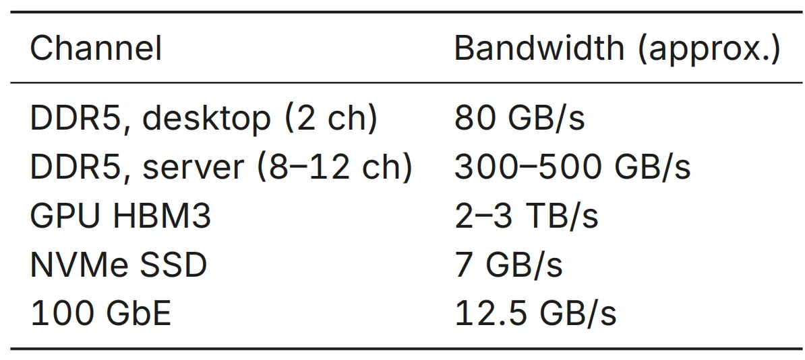

### 程序性能瓶颈

#### Roofline Model

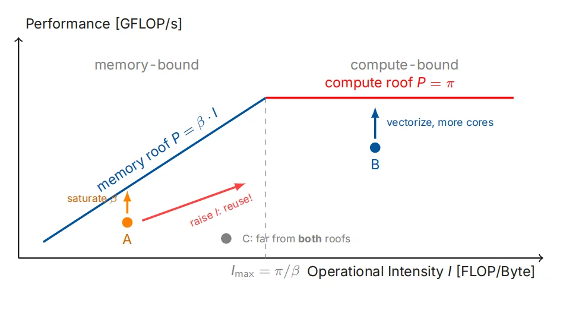

👉横轴I表示每字节内存访问能完成的浮点运算次数，反映了程序的密集程度；纵轴表示每秒完成的浮点运算次数，反映程序性能。

**Can be optimized：**

- A: memory-bound, need to saturate β.（β为内存带宽，其代表系统每秒能传输的数据量，限制了程序性能）
- B: compute-bound $\pi$, use vectorize, FMA.（$\pi$为处理器的理论最大计算能力）
- C: latency-bound, not enough concurrency.（延迟问题）

#### Amdahl’s Law

Let p be the parallelizable fraction, on N cores. S represents "speed up"（加速比）:

<br>

&emsp;&emsp;&emsp; $S(N) = \frac{1}{(1-p)+\frac{p}{N}}$ &emsp;&emsp;&emsp; $S(\infty)=\frac{1}{1-p}$

<br>

💡尽可能增大p的值，找到尽可能多的可并行的地方。

### Two Design Philosophies: CPU vs. GPU

**CPU：minimize latency**

- few powerful cores, huge caches
- out-of-order, branch prediction
- one thread finishes fast

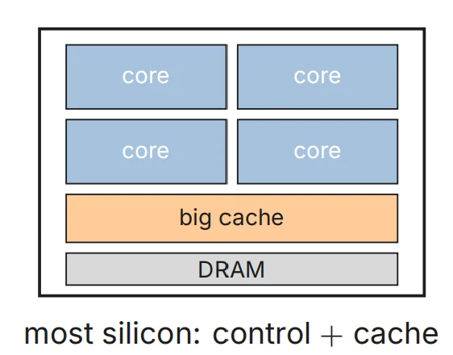

**GPU：maximize throughput**

- thousands of simple lanes
- latency hidden by other warps
- any single thread is not that fast

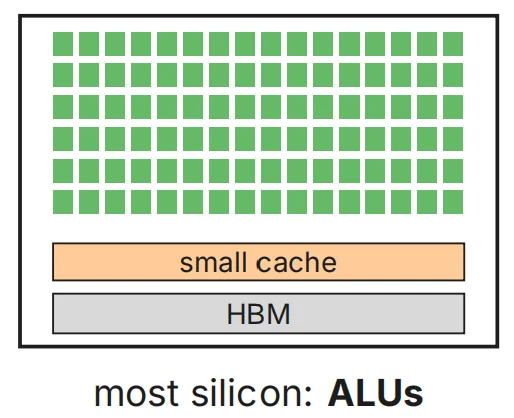

???+ example "Experiment 1: Serial Chain"

    ```C
    for (long i = 0; i < n; i++)
    { x ^= x << 13; x ^= x >> 7; x ^= x << 17; }
    ```

        CPU, 1 core (m701): 2.15 ns/step
        GPU, 1 thread (H800): 17.38 ns/step <- 8x slower

    - need enough parallelism for GPU to win.

???+ example "Experiment 2: Throughput"

    Dense 16-bit GEMM（General Matrix Multiplication）, N = 8192:

        48 CPU cores, MKL bf16 (AMX tiles): 25.4 TFLOPS
        one H800, cuBLAS fp16 (tensor cores): 683 TFLOPS <- 27x

    - every tile of C is independent work: 81922 outputs → millions of parallel tasks → GPU wins 

**CPU must**
- the OS, syscalls, drivers
- branchy control flow
- pointer chasing (trees, parsers)
- latency-critical serial logic
- launching the GPU’s work

**GPU shines**
- GEMM
- stencils, images, rendering
- attention / convolutions
- Monte Carlo, particles
- anything = millions of independent tasks

👉Neither replaces the other — serial work still needs a CPU; throughput
belongs to the lanes.

## Measuring the Machine

### Ceilings

👉**Know Your Ceilings First：**

A performance number is meaningless until you compare it against the
ceiling, so measure the roofs (π Compute Capability, β Memory Bandwidth) first. The roof also tells you when to stop.

???+ question "如何测量？"

    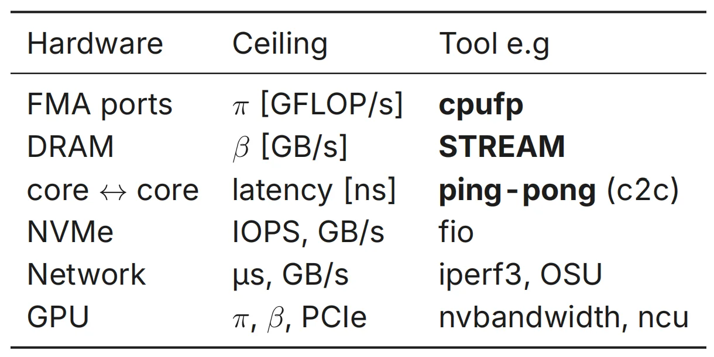

## Profiling the Program

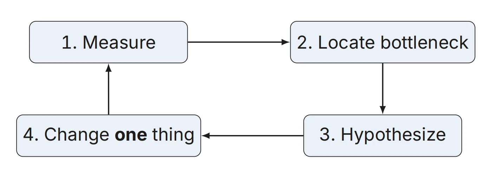

### 案例分析：矩阵乘法（GEMM）

#### Round 0: Naive GEMM

``` C linenums="1"
for (long i = 0; i < n; i++)
    for (long j = 0; j < n; j++)
        for (long k = 0; k < n; k++)
            C[i * n + j] += A[i * n + k] * B[k * n + j];
```

    N=1024 time=4.046 s perf=0.53 GFLOP/s

😅One core’s roof is 82, we are at 0.6%.

???+ question "What Does the Machine Actually See?"

    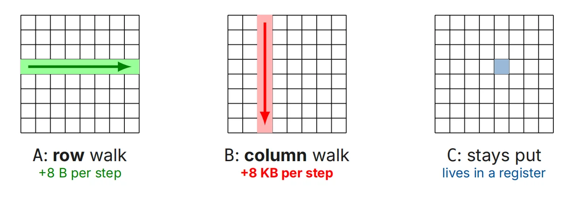

    由于矩阵按行主序存储（同一行数据从左到右连续存在内存里），在内层循环中列遍历矩阵B时，列邻居在内存中相隔甚远，内存地址跳变大。

    - One iteration = 1 FMA + 1 friendly load + 1 hostile load

    👉在缓存中表现就是这样：

    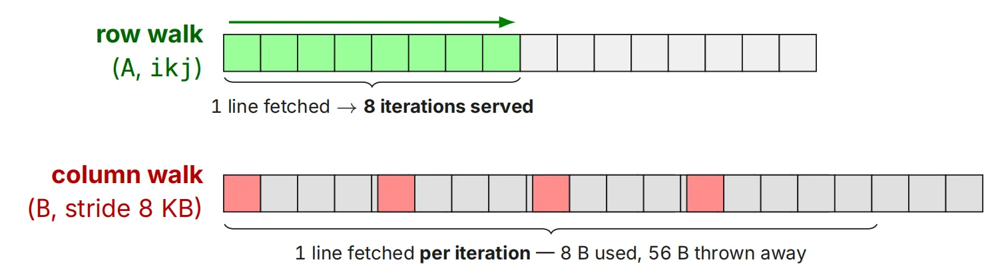

